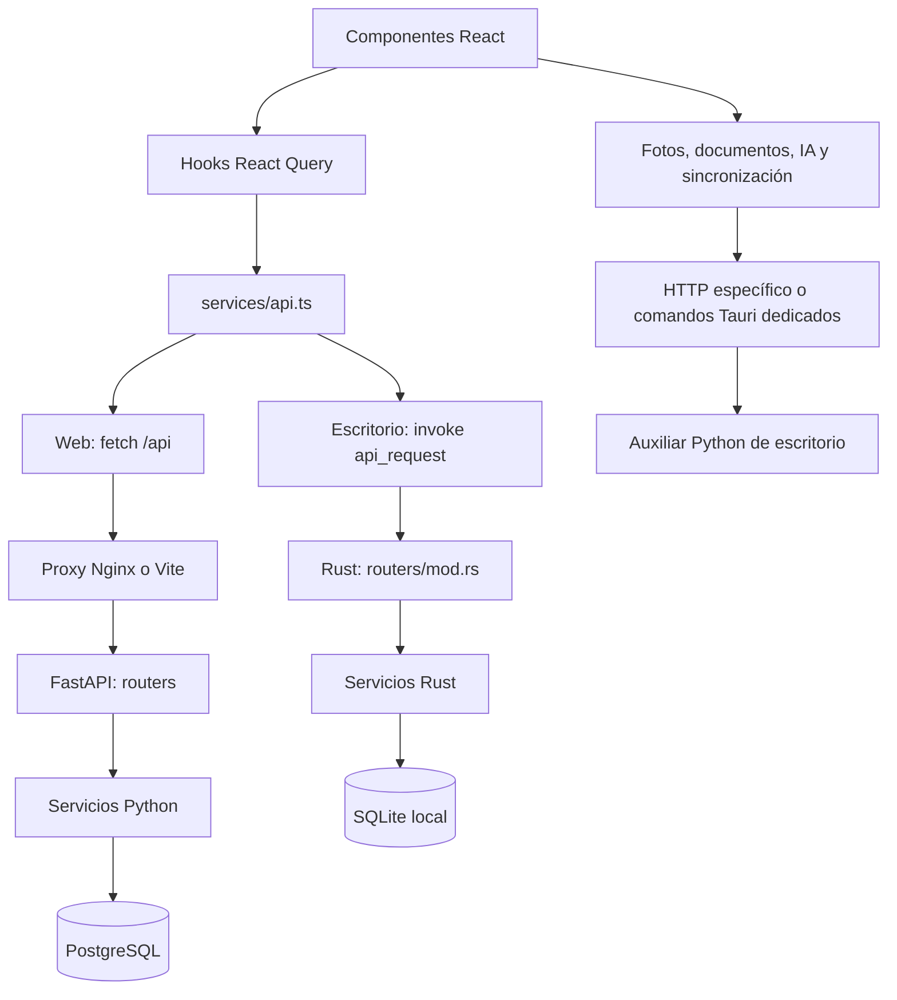

# Arquitectura y mapa de archivos

Fecha de revisión: 4 de octubre de 2026. Referencia: `main`, commit `afb7223`, con actualización local del selector aleatorio de calificaciones.

Este documento describe el código presente en el repositorio y ayuda a localizar los archivos implicados en un cambio. La revisión es estática: no acredita que producción esté actualizada ni que todas las funciones funcionen. Las rutas son relativas a la raíz del repositorio. El inventario final identifica individualmente los archivos versionados; las familias de editor y recursos siguen convenciones comunes explicadas allí.

## 1. Recorrido de una operación

El CRUD ordinario comparte contrato JSON entre plataformas. Las importaciones, fotos y algunas herramientas utilizan llamadas específicas y no pasan necesariamente por `api.ts`. Hay comprobaciones `isTauri()` fuera de ese archivo: no asumir que toda la plataforma se decide en un único punto.

### Puntos de entrada

| Archivo | Qué controla |
| --- | --- |
| [frontend-src/index.html](frontend-src/index.html) | Documento HTML inicial y montaje de la aplicación. |
| [frontend-src/index.tsx](frontend-src/index.tsx) | Arranque React y proveedor global `QueryClientProvider`. |
| [frontend-src/App.tsx](frontend-src/App.tsx) | Navegación, selección de curso/clase/materia, hidratación de datos, callbacks entre vistas, inicialización y operaciones de copia/restablecimiento. Tiene lógica de coordinación, no es solo un contenedor visual. |
| [frontend-src/services/api.ts](frontend-src/services/api.ts) | Peticiones JSON, errores HTTP y elección entre FastAPI y Tauri; excepciones de backup y sincronización Educastur. |
| [frontend-src/services/apiAdapters.ts](frontend-src/services/apiAdapters.ts) | Traducción del modelo API al modelo de las vistas, unión alumno/matrícula, fotos y sincronización de listas. |
| [frontend-src/types/api.ts](frontend-src/types/api.ts) | Contrato TypeScript de entidades, entradas y modificaciones de la API. |
| [frontend-src/types.ts](frontend-src/types.ts) | Modelo usado por componentes, configuración, vistas e instrumentos. |
| [api/app/main.py](api/app/main.py) | Creación de FastAPI, registro de routers y aplicación de migraciones al arrancar. |
| [api/app/services/db.py](api/app/services/db.py) | Conexiones PostgreSQL, commit/rollback y migraciones SQL. |
| [api/app/services/schemas.py](api/app/services/schemas.py) | Base Pydantic, alias snake_case/camelCase y comparación de versiones `updated_at`. |
| [api/app/services/auth.py](api/app/services/auth.py) | Exige identidad mediante `X-authentik-username`. |
| [frontend-src/src-tauri/src/main.rs](frontend-src/src-tauri/src/main.rs) | Entrada del ejecutable de escritorio. |
| [frontend-src/src-tauri/src/lib.rs](frontend-src/src-tauri/src/lib.rs) | Arranque Tauri, estado de la base, registro de comandos y protocolo de fotos. |
| [frontend-src/src-tauri/src/routers/mod.rs](frontend-src/src-tauri/src/routers/mod.rs) | Despacho de método/ruta JSON a servicios SQLite. |
| [frontend-src/src-tauri/src/db.rs](frontend-src/src-tauri/src/db.rs) | Directorio de datos, conexión SQLite, claves foráneas y lista ordenada de migraciones embebidas. |
| [frontend-src/src-tauri/src/services/mod.rs](frontend-src/src-tauri/src/services/mod.rs) | Registro de servicios y mezcla de campos para modificaciones parciales. |
| [frontend-src/src-tauri/src/error.rs](frontend-src/src-tauri/src/error.rs) | Representación de errores del backend de escritorio. |

## 2. Modelo de datos y reglas que atraviesan archivos

- `students` representa personas; `enrollments` representa su matrícula en una clase. Los datos personales y los datos del curso no son intercambiables. `joinStudentEnrollment` en `apiAdapters.ts` los reúne para la interfaz.
- `courses` representa materias/niveles; `academic_years` representa cursos académicos. `academic_year_courses` los relaciona. `classes` representa los grupos docentes de ese año.
- Currículo: competencias clave y descriptores, competencias específicas, criterios y saberes. Las unidades de programación y los instrumentos enlazan con esos elementos.
- Evaluación: categorías, actividades (`assignments`) y calificaciones (`grades`). Las notas persistidas referencian matrículas; el modelo visual puede presentarlas por alumno.
- El horario combina franjas y festivos del año académico con sesiones y excepciones de las clases. Diario y ausencias usan fecha/franja: cambiar índices tiene efectos más amplios que cambiar una etiqueta.
- Los cálculos de notas viven principalmente en el frontend. `grades` almacena puntuaciones y resultados; la visualización y ponderación se resuelven en `services/gradeCalculations/`.
- React Query mantiene cachés por entidad/clase/curso. Tras una mutación hay que invalidar también las entidades afectadas por cascadas; por ejemplo, borrar una actividad invalida actividades y notas.
- Las respuestas JSON usan camelCase; las columnas SQL usan snake_case. Python utiliza Pydantic y Rust construye JSON expresamente. Añadir una columna no basta para que aparezca en pantalla.
- La web aplica concurrencia optimista en determinadas entidades mediante `expectedUpdatedAt`; SQLite usa un proceso y conexión protegida por mutex. No asumir controles idénticos.
- Las copias incluyen tablas en orden de dependencias y fotos codificadas. Actualmente la lista del servicio Python contiene 26 tablas; no usar la cifra histórica de 24 como lista exhaustiva.

## 3. Guía rápida según el cambio

En esta tabla, `F` significa `frontend-src/`, `B` significa `api/app/` y `R` significa `frontend-src/src-tauri/src/`. Son abreviaturas exclusivas de esta sección.

| Cambio o síntoma | Archivos por los que empezar | Revisar también |
| --- | --- | --- |
| Navegación, cabecera, selección de clase/materia | `F/App.tsx`, `F/components/Sidebar.tsx`, `F/components/PageHeader.tsx` | `F/types.ts`, `F/theme/`, carga diferida de vistas. |
| Cuaderno, columnas y edición de notas | `F/components/GradebookTable.tsx`, `GradeEntryModal.tsx`, `AssignmentModal.tsx` | `F/hooks/useGrades.ts`, `useAssignments.ts`, `F/services/apiAdapters.ts`, `B/services/grades.py`, `assignments.py`, equivalentes Rust. |
| Dado para elegir alumnado al calificar | `F/components/RandomStudentPickerModal.tsx`, `GradebookTable.tsx`, `GradeEntryModal.tsx`, `F/services/randomGradeEntry.ts` | Prioriza alumnado sin nota, reutiliza el método de la actividad y vuelve al selector tras guardar. Tests del selector y compatibilidad en `randomGradeEntry.test.ts` y `apiAdapters.test.ts`. |
| Compatibilidad con rondas antiguas | `F/components/AssignmentModal.tsx`, `F/services/apiAdapters.ts`, `GradebookTable.tsx` | `question_round` no se ofrece para actividades nuevas; se mantiene su lectura y el historial previo al editar. `QuestionRoundModal.tsx` ya no se abre desde el cuaderno. |
| Una media, ponderación o nota final incorrecta | `F/services/gradeCalculations/categoryEngine.ts`, `criterialEngine.ts`, `tools.ts` | `F/services/gradeCalculations.test.ts`, adaptadores, puntuación directa original y normalizada. |
| Informes curriculares | `F/components/CriteriaAchievement.tsx`, `SpecificCompetenceAchievement.tsx`, `KeyCompetenceAchievement.tsx`, `DescriptorAchievement.tsx` | `DrilldownModal.tsx`, motor criterial y relaciones curriculares. |
| Horario y recreos | `F/components/HorarioView.tsx`, `F/components/settings/ScheduleManager.tsx`, `AcademicYearManager.tsx` | `F/utils.ts`, `HoyView.tsx`, `ClassJournal.tsx`, `F/types/api.ts`, `B/services/academic_years.py`, migración 0023 y equivalente Rust. |
| Importación del horario PDF | `F/components/ImportScheduleModal.tsx`, `B/routers/horario.py`, `B/services/horario_pdf.py` | Copia `F/src-tauri/python-helper/src/horario_pdf.py`, comando en `R/lib.rs`, puente `R/services/python_helper.rs`, creación de categorías y normalización de materias. |
| Agenda por día/semana/mes | `F/components/CalendarView.tsx`, `F/components/calendar/DayView.tsx`, `WeekView.tsx`, `MonthView.tsx` | `calendarEvents.ts`, `calendarColors.ts`, notas, reuniones, tareas, horario y fechas de unidades. |
| Diario y consulta por clase | `F/components/ClassJournal.tsx`, `ClassJournalRange.tsx`, `QuickJournalModal.tsx` | `F/hooks/useJournalEntries.ts`, `B/routers/journal_entries.py`, `B/services/journal_entries.py`, `R/services/journal_entries.rs`. |
| Pantalla Hoy y avisos | `F/components/HoyView.tsx`, `F/services/dashboardNotices.ts` | Tests de avisos, horario, festivos, sesiones y agenda. |
| Datos personales del alumnado | `F/components/StudentPersonalDataModal.tsx`, `StudentSummaryModal.tsx`, `F/hooks/useApiStudents.ts` | `B/services/students.py`, `R/services/students.rs`, ambos tipos y adaptadores. |
| Matrícula, orden, apoyos o plano | `F/components/StudentFlagsModal.tsx`, `PlanoClaseModal.tsx`, `F/hooks/useEnrollments.ts` | `B/services/enrollments.py`, `R/services/enrollments.rs`, distinción persona/matrícula. El plano usa `F/services/classroomLayout.ts` para selección rectangular, movimiento en grupo y cuadrícula; guarda cada matrícula por el callback de `GradebookTable.tsx`. |
| Importar alumnado de SAUCE | `F/components/ImportSauceStudentsModal.tsx`, `F/services/sauceImport.ts` | `sauceImport.test.ts`, `F/hooks/useApiStudents.ts`, matrículas y seguimiento de importación. |
| Fotos y PDF de fotos | `F/components/ImportPhotosModal.tsx`, `StudentPhotoAvatar.tsx`, `F/services/apiAdapters.ts` | `B/routers/photos.py`, `B/services/photos.py`, `fotos_pdf.py`, `R/services/photos.rs`, `R/lib.rs`, copia Python auxiliar. |
| Faltas y Educastur | `F/hooks/useAbsences.ts`, `useEducastur.ts`, `F/components/settings/EducasturSyncSettings.tsx` | `B/services/absences.py`, `educastur_sync.py`, `educastur_client.py`, router; Rust `educastur.rs` y auxiliar `educastur_orchestrator.py`. |
| Currículo y plantillas | `F/components/CurriculumManager.tsx`, `F/hooks/useCurriculumImport.ts`, `F/curriculumPresets.ts` | CSV en `F/public/curriculos-*`, hooks y servicios de competencias/criterios/saberes. |
| Programación y situaciones de aprendizaje | `F/components/ProgrammingManager.tsx`, `GenerarSituacionAprendizajeModal.tsx`, `F/hooks/useProgrammingUnits.ts` | `F/services/programmingUnitShare.ts`, `B/services/programming_units.py`, `B/services/prompts/situacion_aprendizaje.py`, Rust. |
| Instrumentos de evaluación e importación desde SA | `F/components/EvaluationToolManager.tsx`, `GenerarInstrumentoIAModal.tsx`, `ImportarDesdeSAModal.tsx` | `F/services/generarInstrumentoIA.ts`, `instrumentoATexto.ts`, hooks, servicio y prompt de instrumento. |
| Reuniones y actas | `F/components/ReunionesView.tsx`, `ReunionEditorScreen.tsx`, `ActaReunionTab.tsx` | `F/services/generarActaReunion.ts`, `F/hooks/useMeetings.ts`, `B/services/meetings.py`, prompt y Rust. |
| Anonimización y adaptación de material | `F/components/AiToolsView.tsx`, `AdaptarMaterialView.tsx`, `F/hooks/useAnonimizar.ts` | `B/routers/ai_tools.py`, `B/services/anonimizador.py`, extractores, diccionarios y copias auxiliares. |
| Detección curricular | `F/components/DeteccionCurricularView.tsx`, `F/services/generarDeteccionCurricular.ts` | `B/routers/prompts.py`, `B/services/prompts/deteccion_curricular.py`, currículo del curso. |
| Groq, IA local, progreso y cancelación | `B/services/llm_client.py`, `B/routers/prompts.py` | `F/hooks/useGroqDisponible.ts`, `useIaLocalDisponible.ts`, `useTrabajosIA.ts`, `F/components/TrabajosIAPanel.tsx`, servicios `generar*.ts`. |
| Copias, restauración y borrado total | `F/components/settings/BackupManager.tsx`, `F/App.tsx` | `B/services/backup.py`, `B/routers/backup.py`, `R/services/backup.rs`, comandos dedicados en `R/lib.rs`, `F/services/api.ts`. |
| Rescate/sincronización escritorio-servidor | `F/components/settings/ServerSyncSettings.tsx`, `R/services/server_sync.rs` | `R/lib.rs`, configuración externa y scripts del servidor que no están en este repositorio. |
| Apariencia general | `F/index.css`, `F/theme/palette.ts`, `F/theme/components/` | Componente visual base y clases propias de la vista. No todo el aspecto se controla desde el tema. |
| Editor enriquecido o exportación DOCX | `F/components/RichTextEditor.tsx`, `DownloadDocxButton.tsx` | Familias `tiptap-*`, `F/lib/tiptap-utils.ts`, estilos SCSS y extractores Python si hay importación. |
| Añadir un campo persistido | Ambos tipos TS, adaptador, hook, servicio Python, servicio Rust | Migración PostgreSQL y SQLite; registrar SQLite en `R/db.rs`; copias/exportaciones; formulario y pruebas apropiadas. |
| Añadir un endpoint | Router Python y registro en `B/main.py` | `R/routers/mod.rs` si requiere escritorio; `R/lib.rs` si necesita comando dedicado; hook y contrato TS. |

## 4. Backend web y backend de escritorio

### Entidades CRUD

Cada router en `api/app/routers/` define rutas HTTP, parámetros y errores de transporte. Cada servicio homónimo en `api/app/services/` contiene modelos de entrada/salida, consultas y reglas de persistencia. En escritorio los servicios Rust producen el mismo contrato JSON, pero no comparten implementación con Python.

Correspondencias con nombres diferentes:

| Concepto | Hook React | Python | Rust |
| --- | --- | --- | --- |
| Alumnado | `useApiStudents.ts` | `students.py` | `students.rs` |
| Clases | `useApiClasses.ts` | `classes.py` | `classes.rs` |
| Competencias específicas | `useSpecificCompetences.ts` | `competences.py` | `specific_competences.rs` |
| Criterios | `useEvaluationCriteria.ts` | `criteria.py` | `evaluation_criteria.rs` |
| Educastur | `useEducastur.ts` | `educastur_sync.py` + `educastur_client.py` | `educastur.rs` + auxiliar Python |

Los demás nombres de entidad se reconocen en el inventario. Los hooks controlan consulta, mutación e invalidación; los componentes no deben tomar los nombres de las tablas como contrato directo.

### Migraciones

`api/app/migrations/*.sql` se aplica en orden por `services/db.py`; cada fichero se registra en `schema_migrations` dentro de la transacción. `frontend-src/src-tauri/src/migrations/*.sql` se compila dentro del ejecutable y su orden lo fija la lista en `src/db.rs`.

La numeración web y escritorio es distinta. No copiar números automáticamente ni modificar una migración ya aplicada para introducir un cambio nuevo: crear una migración posterior y comprobar los dos dialectos. Las migraciones iniciales y posteriores, juntas, definen el esquema actual.

### Diferencias actuales que conviene tener presentes

En esta revisión, PostgreSQL tiene migraciones para recreos (`0023_break_periods.sql`) y rondas (`0027_question_round.sql`). SQLite termina en `0012_reuniones_acta.sql`; su servicio de años no incluye `breakPeriodIndexes` y el de actividades no incluye `questionRoundDescription`. Es una diferencia visible en el código, pendiente de validar funcionalmente; no asumir que las últimas prestaciones web tienen persistencia equivalente en escritorio.

### Fotos, auxiliar Python y sincronización

Las fotos usan HTTP binario en web y protocolo `studentphoto`/comandos dedicados en Tauri. Los PDF y la anonimización utilizan el auxiliar `python-helper`, empaquetado con PyInstaller como recurso Tauri. Su `src/main.py` recibe stdin y devuelve JSON; Rust resuelve el acceso a SQLite.

Las copias manuales de extractores y diccionarios del backend y del auxiliar deben revisarse juntas. `fotos_pdf.py` usa motores de render distintos entre plataformas: mantener la lógica equivalente sin exigir archivos idénticos.

La sincronización de rescate del escritorio utiliza GitHub y cifrado age. `server_sync_config.json` se guarda en el directorio de datos y contiene configuración propia; no forma parte de la copia del dominio. Los scripts de backup/restauración del servidor mencionados por Rust no se incluyen aquí.

## 5. IA y documentos

`api/app/routers/prompts.py` concentra disponibilidad, extracción de documentos, generación de prompts, llamadas a proveedores, trabajos asíncronos, consulta de progreso y cancelación. Los textos y la interpretación de respuestas se reparten en `services/prompts/*.py`. `llm_client.py` gestiona Groq y el servidor de IA/visión.

Las herramientas de anonimización se exponen en `routers/ai_tools.py`; el mapa de reidentificación se devuelve al frontend y no se persiste por esos endpoints. Revisar memoria y transferencia de ese mapa cuando se cambie el flujo.

Los servicios frontend `generar*.ts` contienen llamadas HTTP específicas. `useTrabajosIA.ts` está deshabilitado en Tauri. El CRUD compartido no implica disponibilidad automática de la generación remota en escritorio. Revisar las ramas de plataforma de la vista antes de extender una función de IA.

### Funciones implementadas por plataforma

Esta tabla describe rutas y comandos presentes en el código; su funcionamiento no se ha probado durante esta revisión.

| Función | Web | Escritorio | Archivos que conectan ambas versiones |
| --- | --- | --- | --- |
| Mostrar, subir y borrar fotos | HTTP binario y almacenamiento PostgreSQL | Protocolo de fotos, comandos Tauri y BLOB SQLite | `services/apiAdapters.ts`, router/servicio photos, `src-tauri/src/lib.rs`. |
| Importar horario PDF | FastAPI y pdfplumber | Comando `importar_horario_pdf` y auxiliar Python | `ImportScheduleModal.tsx`, ambos `horario_pdf.py`, puente `python_helper.rs`. |
| Importar calendario PDF | Router calendario y extractor Python | Comando `importar_calendario_pdf` y auxiliar Python | `src-tauri/src/lib.rs`, ambos `calendario_pdf.py` y puente Rust. |
| Importar fotos desde PDF | Servicio Python y revisión frontend | Comando `importar_fotos_pdf`, auxiliar Python y guardado Rust | `ImportPhotosModal.tsx`, ambos `fotos_pdf.py`, servicio Rust de fotos. |
| Sincronizar ausencias con Educastur | Cliente y orquestación Python | Rust prepara/persiste datos; auxiliar realiza login, envío y logout | `useEducastur.ts`, `educastur_sync.py`, `educastur.rs`, `educastur_orchestrator.py`. |
| Anonimizar texto y DOCX; reintegrar DOCX | Endpoints `/ai-tools/*` | Comandos dedicados y auxiliar Python | `AiToolsView.tsx`, `useAnonimizar.ts`, ambos anonimizadores y diccionarios. |
| Preparar prompts de SA, instrumentos, adaptación, actas y detección curricular | Servicios Python de prompts | Construcción de prompts en Rust con datos SQLite | `src-tauri/src/services/prompts.rs`, mini-router Rust y vistas correspondientes. |
| Validar respuestas de SA, instrumentos y detección curricular | Endpoints de validación Python | Rutas de validación en Rust | Routers `prompts`, servicio Rust y servicios/componentes frontend. |
| Generación directa con Groq/servidor IA y cola de trabajos | Implementada mediante backend web | Estas vías se ocultan en las vistas revisadas; se utiliza copiar prompt a IA externa y pegar respuesta | `llm_client.py`, `routers/prompts.py`, `useTrabajosIA.ts`, ramas `isTauri()` de los asistentes. |

Por tanto, el escritorio dispone de funciones de IA asistida y tratamiento documental. El auxiliar aporta las dependencias Python; la preparación/validación de prompts corresponde a Rust. No confundir disponer de herramientas de IA con integrar las llamadas directas a los proveedores.

Las rutas de esta tabla que empiezan por `services/`, `components/` o `src-tauri/` se interpretan dentro de `frontend-src/`; los archivos Python del backend se encuentran en `api/app/`. Los pares de extractores se identifican individualmente en el inventario.

## 6. Configuración, ejecución y secretos

| Archivo | Responsabilidad |
| --- | --- |
| [compose.yaml](compose.yaml) | Despliegue web: Nginx, API, redes externas y volúmenes del servidor. Presupone infraestructura externa. |
| [compose.local.yaml](compose.local.yaml) | PostgreSQL/API del equipo, puertos 5433/8000 limitados a localhost y volumen local. Pasa la clave opcional Groq a la API. |
| `.env` (ignorado) | Variables del backend desplegado: `DATABASE_URL`, `GROQ_API_KEY` opcional y otras variables según servicio. |
| `.env.local` (ignorado) | `LOCAL_POSTGRES_PASSWORD`, usuario/base opcionales y `GROQ_API_KEY` para el compose local. No contiene datos del inventario versionado. |
| [nginx/default.conf](nginx/default.conf) | Estáticos y fallback SPA, caché, límite de subida y proxy `/api/` con tiempo de espera. |
| [frontend-src/vite.config.ts](frontend-src/vite.config.ts) | React/Tailwind, alias, servidor 3000 y proxy a localhost:8000; inyecta identidad `dev-local`. |
| [frontend-src/package.json](frontend-src/package.json) | Dependencias y comandos npm, lint, tests, build y Tauri. npm es el gestor exigido. |
| [frontend-src/package-lock.json](frontend-src/package-lock.json) | Resolución fijada de dependencias npm; actualizar junto con package.json. |
| `api/Dockerfile`, `api/requirements.txt` | Imagen de la API y dependencias Python. |
| `frontend-src/src-tauri/Cargo.toml`, `Cargo.lock` | Dependencias Rust y variante portable. |
| [frontend-src/src-tauri/tauri.conf.json](frontend-src/src-tauri/tauri.conf.json) | Nombre/identificador, ventana, build, recursos Python e instalador NSIS. |
| [frontend-src/src-tauri/capabilities/default.json](frontend-src/src-tauri/capabilities/default.json) | Permisos Tauri declarados para la aplicación. |
| `.gitignore` y los `.gitignore` internos | Exclusión de secretos, dependencias y artefactos; revisar al añadir archivos de configuración. |

Arranque local del backend: `docker compose --env-file .env.local -f compose.local.yaml up -d --build`. Frontend: desde `frontend-src`, `npm ci` y `npm run dev`. Escritorio: `npm run tauri:dev`, con Vite en 3001, Rust/MSVC y recursos del auxiliar preparados.

La variante instalada guarda SQLite en el directorio de datos de Tauri; la portable usa `data/` junto al ejecutable. El nombre de la base es `profeplanner.sqlite3`. La web exige proxy de identidad de confianza; el proxy Vite simula ese contrato para desarrollo. `/health` comprueba respuesta HTTP y `services/healthCheck.ts` del frontend inspecciona integridad del modelo: son comprobaciones distintas.

Este documento no almacena claves, contraseñas ni contenido de archivos privados. `CLAUDE.md` es una memoria local ignorada y tiene afirmaciones antiguas; la referencia para cambios es el código actual y la documentación versionada.

## 7. Validación según el área

| Área modificada | Validación pertinente |
| --- | --- |
| Interfaz y contratos TypeScript | `npm run lint`, `npm run build`; abrir la vista afectada con datos representativos. |
| Cálculos, importadores y avisos | `npm test`; ampliar casos relevantes en los tests ya existentes. |
| Persistencia web | Probar endpoint contra PostgreSQL local y migraciones en una copia; comprobar validación, claves foráneas y conflictos cuando corresponda. |
| Persistencia escritorio | `cargo test` desde `frontend-src/src-tauri` y probar el flujo Tauri si se modifican comandos, recursos o protocolos. |
| Backup | Exportar/restaurar sobre una base de prueba y comparar entidades y fotos; restaurar sustituye datos. |
| Extractores y Educastur | Probar con documentos de muestra sin datos personales y mantener la equivalencia del auxiliar; no usar sincronización real como prueba automática. |

No se han ejecutado builds ni pruebas funcionales para redactar este documento. Las comprobaciones realizadas son inspección del código y validación del inventario/rutas del documento.

## 8. Inventario por archivo

Las tablas siguientes cubren los archivos versionados del commit de referencia y los archivos del selector incorporados localmente. Las responsabilidades de componentes especializados se resumen por nombre. Es un índice de localización, no una especificación exhaustiva de cada función. Recursos repetidos se identifican individualmente sin duplicar una explicación larga.

### Raíz y despliegue

| Archivo | Qué controla |
| --- | --- |
| [.claude/launch.json](.claude/launch.json) | Configuración de lanzamiento del entorno de desarrollo para Claude; no controla la aplicación en producción. |
| [.gitignore](.gitignore) | Reglas de exclusión de archivos privados, dependencias y artefactos. |

### Arranque y entorno API

| Archivo | Qué controla |
| --- | --- |
| [api/app/main.py](api/app/main.py) | Arranque FastAPI, migraciones y registro de routers. |

### Migraciones PostgreSQL

| Archivo | Qué controla |
| --- | --- |
| [api/app/migrations/0001_baseline.sql](api/app/migrations/0001_baseline.sql) | Cambio de esquema/datos: baseline. Tablas: app_db, app_db_history, student_photos. |
| [api/app/migrations/0002_reference_and_academic_years.sql](api/app/migrations/0002_reference_and_academic_years.sql) | Cambio de esquema/datos: reference and academic years. Tablas: academic_years, app_preferences, basic_knowledge, courses, evaluation_criteria, evaluation_periods, evaluation_tools, key_competences, operational_descriptors, programming_units, shortcuts, specific_competence_descriptors, specific_competences, students. |
| [api/app/migrations/0003_instance_data.sql](api/app/migrations/0003_instance_data.sql) | Cambio de esquema/datos: instance data. Tablas: agenda_notes, assignments, categories, classes, enrollments, grades, journal_entries, meetings, tasks. |
| [api/app/migrations/0004_operational_descriptor_stage.sql](api/app/migrations/0004_operational_descriptor_stage.sql) | Cambio de esquema/datos: operational descriptor stage. Tablas: operational_descriptors. |
| [api/app/migrations/0005_academic_year_courses.sql](api/app/migrations/0005_academic_year_courses.sql) | Cambio de esquema/datos: academic year courses. Tablas: academic_year_courses. |
| [api/app/migrations/0006_retire_blob_and_student_photos.sql](api/app/migrations/0006_retire_blob_and_student_photos.sql) | Cambio de esquema/datos: retire blob and student photos. Tablas: app_db, app_db_history, student_photos, students. |
| [api/app/migrations/0007_absences.sql](api/app/migrations/0007_absences.sql) | Cambio de esquema/datos: absences. Tablas: absences. |
| [api/app/migrations/0008_educastur_config.sql](api/app/migrations/0008_educastur_config.sql) | Cambio de esquema/datos: educastur config. Tablas: educastur_config. |
| [api/app/migrations/0009_absences_allow_blank_tipo.sql](api/app/migrations/0009_absences_allow_blank_tipo.sql) | Cambio de esquema/datos: absences allow blank tipo. Tablas: absences. |
| [api/app/migrations/0010_students_nie_nacionalidad.sql](api/app/migrations/0010_students_nie_nacionalidad.sql) | Cambio de esquema/datos: students nie nacionalidad. Tablas: students. |
| [api/app/migrations/0011_students_import_tracking.sql](api/app/migrations/0011_students_import_tracking.sql) | Cambio de esquema/datos: students import tracking. Tablas: students. |
| [api/app/migrations/0012_basic_knowledge_block_name.sql](api/app/migrations/0012_basic_knowledge_block_name.sql) | Cambio de esquema/datos: basic knowledge block name. Tablas: basic_knowledge. |
| [api/app/migrations/0013_situacion_aprendizaje.sql](api/app/migrations/0013_situacion_aprendizaje.sql) | Cambio de esquema/datos: situacion aprendizaje. Tablas: classes, programming_units. |
| [api/app/migrations/0014_teacher_profile.sql](api/app/migrations/0014_teacher_profile.sql) | Cambio de esquema/datos: teacher profile. Tablas: app_preferences. |
| [api/app/migrations/0015_criterial_exam_tool_type.sql](api/app/migrations/0015_criterial_exam_tool_type.sql) | Cambio de esquema/datos: criterial exam tool type. Tablas: assignments, evaluation_tools. |
| [api/app/migrations/0016_assignment_short_name.sql](api/app/migrations/0016_assignment_short_name.sql) | Cambio de esquema/datos: assignment short name. Tablas: assignments. |
| [api/app/migrations/0017_evaluation_tools_course.sql](api/app/migrations/0017_evaluation_tools_course.sql) | Cambio de esquema/datos: evaluation tools course. Tablas: evaluation_tools. |
| [api/app/migrations/0018_puntuacion_maxima_directa.sql](api/app/migrations/0018_puntuacion_maxima_directa.sql) | Cambio de esquema/datos: puntuacion maxima directa. Tablas: assignments, grades. |
| [api/app/migrations/0019_teacher_notes.sql](api/app/migrations/0019_teacher_notes.sql) | Cambio de esquema/datos: teacher notes. Tablas: app_preferences. |
| [api/app/migrations/0020_teacher_personal_data.sql](api/app/migrations/0020_teacher_personal_data.sql) | Cambio de esquema/datos: teacher personal data. Tablas: app_preferences. |
| [api/app/migrations/0021_enrollment_pti.sql](api/app/migrations/0021_enrollment_pti.sql) | Cambio de esquema/datos: enrollment pti. Tablas: enrollments. |
| [api/app/migrations/0022_programa_bilingue.sql](api/app/migrations/0022_programa_bilingue.sql) | Cambio de esquema/datos: programa bilingue. Tablas: enrollments. |
| [api/app/migrations/0023_break_periods.sql](api/app/migrations/0023_break_periods.sql) | Cambio de esquema/datos: break periods. Tablas: academic_years. |
| [api/app/migrations/0024_reuniones_tipo_otras.sql](api/app/migrations/0024_reuniones_tipo_otras.sql) | Cambio de esquema/datos: reuniones tipo otras. Tablas: meetings. |
| [api/app/migrations/0025_enrollment_orden.sql](api/app/migrations/0025_enrollment_orden.sql) | Cambio de esquema/datos: enrollment orden. Tablas: enrollments. |
| [api/app/migrations/0026_reuniones_acta.sql](api/app/migrations/0026_reuniones_acta.sql) | Cambio de esquema/datos: reuniones acta. Tablas: meetings. |
| [api/app/migrations/0027_question_round.sql](api/app/migrations/0027_question_round.sql) | Cambio de esquema/datos: question round. Tablas: assignments. |

### Routers FastAPI

| Archivo | Qué controla |
| --- | --- |
| [api/app/routers/absences.py](api/app/routers/absences.py) | Rutas HTTP y validación de transporte para ausencias. |
| [api/app/routers/academic_years.py](api/app/routers/academic_years.py) | Rutas HTTP y validación de transporte para años académicos, evaluaciones y relación con materias. |
| [api/app/routers/agenda_notes.py](api/app/routers/agenda_notes.py) | Rutas HTTP y validación de transporte para notas de agenda. |
| [api/app/routers/ai_tools.py](api/app/routers/ai_tools.py) | Endpoints de anonimización, reintegración y documentos. |
| [api/app/routers/assignments.py](api/app/routers/assignments.py) | Rutas HTTP y validación de transporte para actividades evaluables. |
| [api/app/routers/backup.py](api/app/routers/backup.py) | Exportación/restauración de tablas, orden de dependencias y fotos. |
| [api/app/routers/basic_knowledge.py](api/app/routers/basic_knowledge.py) | Rutas HTTP y validación de transporte para saberes básicos. |
| [api/app/routers/calendario.py](api/app/routers/calendario.py) | Endpoint de importación del calendario escolar PDF y respuesta del extractor. |
| [api/app/routers/categories.py](api/app/routers/categories.py) | Rutas HTTP y validación de transporte para categorías de evaluación. |
| [api/app/routers/classes.py](api/app/routers/classes.py) | Rutas HTTP y validación de transporte para clases, horario y configuración de grupo. |
| [api/app/routers/competences.py](api/app/routers/competences.py) | Rutas HTTP y validación de transporte para competencias específicas. |
| [api/app/routers/courses.py](api/app/routers/courses.py) | Rutas HTTP y validación de transporte para materias/niveles. |
| [api/app/routers/criteria.py](api/app/routers/criteria.py) | Rutas HTTP y validación de transporte para criterios de evaluación. |
| [api/app/routers/educastur.py](api/app/routers/educastur.py) | Configuración, filtros y sincronización Educastur. |
| [api/app/routers/enrollments.py](api/app/routers/enrollments.py) | Rutas HTTP y validación de transporte para matrículas y datos de alumno en la clase. |
| [api/app/routers/evaluation_tools.py](api/app/routers/evaluation_tools.py) | Rutas HTTP y validación de transporte para instrumentos de evaluación. |
| [api/app/routers/grades.py](api/app/routers/grades.py) | Rutas HTTP y validación de transporte para calificaciones y resultados de instrumentos. |
| [api/app/routers/health.py](api/app/routers/health.py) | Comprobación HTTP de vida de la API. |
| [api/app/routers/horario.py](api/app/routers/horario.py) | Endpoint de importación del horario oficial PDF y respuesta del extractor. |
| [api/app/routers/journal_entries.py](api/app/routers/journal_entries.py) | Rutas HTTP y validación de transporte para anotaciones de diario por fecha/franja. |
| [api/app/routers/key_competences.py](api/app/routers/key_competences.py) | Rutas HTTP y validación de transporte para competencias clave y descriptores. |
| [api/app/routers/meetings.py](api/app/routers/meetings.py) | Rutas HTTP y validación de transporte para reuniones y actas. |
| [api/app/routers/photos.py](api/app/routers/photos.py) | Rutas HTTP y validación de transporte para fotos del alumnado. |
| [api/app/routers/preferences.py](api/app/routers/preferences.py) | Rutas HTTP y validación de transporte para preferencias y perfil docente. |
| [api/app/routers/programming_units.py](api/app/routers/programming_units.py) | Rutas HTTP y validación de transporte para unidades de programación y sesiones. |
| [api/app/routers/prompts.py](api/app/routers/prompts.py) | Construcción/validación de prompts; web además coordina generación y trabajos. |
| [api/app/routers/shortcuts.py](api/app/routers/shortcuts.py) | Rutas HTTP y validación de transporte para accesos directos. |
| [api/app/routers/students.py](api/app/routers/students.py) | Rutas HTTP y validación de transporte para personas y datos personales del alumnado. |
| [api/app/routers/tasks.py](api/app/routers/tasks.py) | Rutas HTTP y validación de transporte para tareas. |

### Servicios Python y diccionarios

| Archivo | Qué controla |
| --- | --- |
| [api/app/services/absences.py](api/app/services/absences.py) | Modelos, consultas PostgreSQL y persistencia de ausencias. |
| [api/app/services/academic_years.py](api/app/services/academic_years.py) | Modelos, consultas PostgreSQL y persistencia de años académicos, evaluaciones y relación con materias. |
| [api/app/services/agenda_notes.py](api/app/services/agenda_notes.py) | Modelos, consultas PostgreSQL y persistencia de notas de agenda. |
| [api/app/services/anonimizador.py](api/app/services/anonimizador.py) | Anonimización/reintegración de texto y DOCX. |
| [api/app/services/assignments.py](api/app/services/assignments.py) | Modelos, consultas PostgreSQL y persistencia de actividades evaluables. |
| [api/app/services/auth.py](api/app/services/auth.py) | Validación de cabecera de identidad del proxy. |
| [api/app/services/backup.py](api/app/services/backup.py) | Exportación/restauración de tablas, orden de dependencias y fotos. |
| [api/app/services/basic_knowledge.py](api/app/services/basic_knowledge.py) | Modelos, consultas PostgreSQL y persistencia de saberes básicos. |
| [api/app/services/calendario_pdf.py](api/app/services/calendario_pdf.py) | Extracción de calendario escolar, festivos y fechas. |
| [api/app/services/categories.py](api/app/services/categories.py) | Modelos, consultas PostgreSQL y persistencia de categorías de evaluación. |
| [api/app/services/classes.py](api/app/services/classes.py) | Modelos, consultas PostgreSQL y persistencia de clases, horario y configuración de grupo. |
| [api/app/services/competences.py](api/app/services/competences.py) | Modelos, consultas PostgreSQL y persistencia de competencias específicas. |
| [api/app/services/courses.py](api/app/services/courses.py) | Modelos, consultas PostgreSQL y persistencia de materias/niveles. |
| [api/app/services/criteria.py](api/app/services/criteria.py) | Modelos, consultas PostgreSQL y persistencia de criterios de evaluación. |
| [api/app/services/db.py](api/app/services/db.py) | Conexiones PostgreSQL y aplicación de migraciones. |
| [api/app/services/educastur_client.py](api/app/services/educastur_client.py) | Protocolo de acceso y operaciones con Educastur. |
| [api/app/services/educastur_sync.py](api/app/services/educastur_sync.py) | Preparación, envío y registro de sincronización de faltas. |
| [api/app/services/enrollments.py](api/app/services/enrollments.py) | Modelos, consultas PostgreSQL y persistencia de matrículas y datos de alumno en la clase. |
| [api/app/services/evaluation_tools.py](api/app/services/evaluation_tools.py) | Modelos, consultas PostgreSQL y persistencia de instrumentos de evaluación. |
| [api/app/services/extraccion_docx.py](api/app/services/extraccion_docx.py) | Extracción de contenido DOCX a Markdown. |
| [api/app/services/extraccion_pdf.py](api/app/services/extraccion_pdf.py) | Extracción de PDF y apoyo OCR/visión. |
| [api/app/services/extraccion_pptx.py](api/app/services/extraccion_pptx.py) | Extracción de presentaciones y apoyo de visión. |
| [api/app/services/fotos_pdf.py](api/app/services/fotos_pdf.py) | Extracción de fotos y correspondencia con alumnado. |
| [api/app/services/grades.py](api/app/services/grades.py) | Modelos, consultas PostgreSQL y persistencia de calificaciones y resultados de instrumentos. |
| [api/app/services/horario_pdf.py](api/app/services/horario_pdf.py) | Extracción y fusión de sesiones del horario oficial PDF. |
| [api/app/services/journal_entries.py](api/app/services/journal_entries.py) | Modelos, consultas PostgreSQL y persistencia de anotaciones de diario por fecha/franja. |
| [api/app/services/key_competences.py](api/app/services/key_competences.py) | Modelos, consultas PostgreSQL y persistencia de competencias clave y descriptores. |
| [api/app/services/llm_client.py](api/app/services/llm_client.py) | Clientes Groq e IA/visión, límites y reintentos. |
| [api/app/services/materias_oficiales.json](api/app/services/materias_oficiales.json) | Diccionario de materias para identificación/anonimización. |
| [api/app/services/meetings.py](api/app/services/meetings.py) | Modelos, consultas PostgreSQL y persistencia de reuniones y actas. |
| [api/app/services/neae_terminos.json](api/app/services/neae_terminos.json) | Diccionario de términos de apoyo educativo. |
| [api/app/services/photos.py](api/app/services/photos.py) | Modelos, consultas PostgreSQL y persistencia de fotos del alumnado. |
| [api/app/services/preferences.py](api/app/services/preferences.py) | Modelos, consultas PostgreSQL y persistencia de preferencias y perfil docente. |
| [api/app/services/programming_units.py](api/app/services/programming_units.py) | Modelos, consultas PostgreSQL y persistencia de unidades de programación y sesiones. |
| [api/app/services/prompts/acta_reunion.py](api/app/services/prompts/acta_reunion.py) | Prompt e interpretación de acta. |
| [api/app/services/prompts/adaptacion_material.py](api/app/services/prompts/adaptacion_material.py) | Prompt de adaptación de material. |
| [api/app/services/prompts/deteccion_curricular.py](api/app/services/prompts/deteccion_curricular.py) | Prompt y validación de elementos curriculares detectados. |
| [api/app/services/prompts/instrumento_evaluacion.py](api/app/services/prompts/instrumento_evaluacion.py) | Prompt e interpretación de instrumentos. |
| [api/app/services/prompts/situacion_aprendizaje.py](api/app/services/prompts/situacion_aprendizaje.py) | Prompt, fragmentación e interpretación de respuestas de SA. |
| [api/app/services/schemas.py](api/app/services/schemas.py) | Modelos Pydantic comunes y comprobación de versiones. |
| [api/app/services/shortcuts.py](api/app/services/shortcuts.py) | Modelos, consultas PostgreSQL y persistencia de accesos directos. |
| [api/app/services/students.py](api/app/services/students.py) | Modelos, consultas PostgreSQL y persistencia de personas y datos personales del alumnado. |
| [api/app/services/tasks.py](api/app/services/tasks.py) | Modelos, consultas PostgreSQL y persistencia de tareas. |

### Arranque y entorno API

| Archivo | Qué controla |
| --- | --- |
| [api/Dockerfile](api/Dockerfile) | Construcción de imagen del backend. |
| [api/requirements.txt](api/requirements.txt) | Dependencias Python del módulo. |
| [api/scripts/seed_local.sql](api/scripts/seed_local.sql) | Datos de ejemplo para la base local. |

### Raíz y despliegue

| Archivo | Qué controla |
| --- | --- |
| [compose.local.yaml](compose.local.yaml) | Base/API de desarrollo local y variables de entorno. |
| [compose.yaml](compose.yaml) | Servicios web, redes y volúmenes de despliegue. |

### Documentación y prototipos

| Archivo | Qué controla |
| --- | --- |
| [docs/ai-generacion-situaciones-aprendizaje.md](docs/ai-generacion-situaciones-aprendizaje.md) | Nota técnica/operativa: ai generacion situaciones aprendizaje. |
| [docs/correo-gmktec-bios.md](docs/correo-gmktec-bios.md) | Nota técnica/operativa: correo gmktec bios. |
| [docs/faltas/educastur_client.py](docs/faltas/educastur_client.py) | Protocolo de acceso y operaciones con Educastur. |
| [docs/faltas/educastur_faltas.py](docs/faltas/educastur_faltas.py) | Prototipo o muestra de investigación Educastur; la implementación activa está en api/app/services y el auxiliar. |
| [docs/faltas/peticion.txt](docs/faltas/peticion.txt) | Prototipo o muestra de investigación Educastur; la implementación activa está en api/app/services y el auxiliar. |
| [docs/faltas/probar_educastur (18-06-26).py](docs/faltas/probar_educastur%20(18-06-26).py) | Prototipo o muestra de investigación Educastur; la implementación activa está en api/app/services y el auxiliar. |
| [docs/faltas/probar_educastur.py](docs/faltas/probar_educastur.py) | Prototipo o muestra de investigación Educastur; la implementación activa está en api/app/services y el auxiliar. |
| [docs/incidencia-gpu-iaserver.md](docs/incidencia-gpu-iaserver.md) | Nota técnica/operativa: incidencia gpu iaserver. |
| [docs/servidor-requisitos.md](docs/servidor-requisitos.md) | Nota técnica/operativa: servidor requisitos. |

### Entrada, tipos y configuración frontend

| Archivo | Qué controla |
| --- | --- |
| [frontend-src/.gitignore](frontend-src/.gitignore) | Reglas de exclusión de archivos privados, dependencias y artefactos. |
| [frontend-src/App.tsx](frontend-src/App.tsx) | Coordinación de vistas, hidratación de clases y callbacks de dominio. |
| [frontend-src/classIcons.ts](frontend-src/classIcons.ts) | Catálogo de iconos para clases. |

### Componentes de aplicación

| Archivo | Qué controla |
| --- | --- |
| [frontend-src/components/AcneaeTag.tsx](frontend-src/components/AcneaeTag.tsx) | Indicador de necesidades de apoyo. |
| [frontend-src/components/ActaReunionTab.tsx](frontend-src/components/ActaReunionTab.tsx) | Asistente de actas, anonimización y revisión. |
| [frontend-src/components/AdaptarMaterialView.tsx](frontend-src/components/AdaptarMaterialView.tsx) | Adaptación de materiales, revisión y vías de IA. |
| [frontend-src/components/AiToolsView.tsx](frontend-src/components/AiToolsView.tsx) | Anonimización de texto/DOCX y reintegración con soporte Tauri. |
| [frontend-src/components/Alert.tsx](frontend-src/components/Alert.tsx) | Componente visual reutilizable Alert; su estilo puede apoyarse en theme/components. |
| [frontend-src/components/AnnualCalendarView.tsx](frontend-src/components/AnnualCalendarView.tsx) | Calendario anual. |
| [frontend-src/components/AnonimizarSeleccionButton.tsx](frontend-src/components/AnonimizarSeleccionButton.tsx) | Anonimización de la selección del editor. |
| [frontend-src/components/AssignmentModal.tsx](frontend-src/components/AssignmentModal.tsx) | Creación/edición de actividades evaluables; propone la fecha local actual para nuevas tareas y conserva la fecha al editar. |
| [frontend-src/components/Badge.tsx](frontend-src/components/Badge.tsx) | Componente visual reutilizable Badge; su estilo puede apoyarse en theme/components. |
| [frontend-src/components/BannerCostero.tsx](frontend-src/components/BannerCostero.tsx) | Elemento gráfico de cabecera. |
| [frontend-src/components/BufferedInput.tsx](frontend-src/components/BufferedInput.tsx) | Campo con edición amortiguada antes de guardar. |
| [frontend-src/components/BufferedTextarea.tsx](frontend-src/components/BufferedTextarea.tsx) | Texto con edición amortiguada antes de guardar. |
| [frontend-src/components/BulkAddStudentModal.tsx](frontend-src/components/BulkAddStudentModal.tsx) | Alta múltiple de alumnado. |
| [frontend-src/components/BulkGradeImportModal.tsx](frontend-src/components/BulkGradeImportModal.tsx) | Importación masiva de calificaciones. |
| [frontend-src/components/Button.tsx](frontend-src/components/Button.tsx) | Componente visual reutilizable Button; su estilo puede apoyarse en theme/components. |

### Componentes de calendario

| Archivo | Qué controla |
| --- | --- |
| [frontend-src/components/calendar/calendarColors.ts](frontend-src/components/calendar/calendarColors.ts) | Colores de los tipos de evento. |
| [frontend-src/components/calendar/calendarEvents.ts](frontend-src/components/calendar/calendarEvents.ts) | Conversión de datos docentes en eventos de agenda. |
| [frontend-src/components/calendar/CalendarHeader.tsx](frontend-src/components/calendar/CalendarHeader.tsx) | Navegación y controles del calendario. |
| [frontend-src/components/calendar/DayView.tsx](frontend-src/components/calendar/DayView.tsx) | Agenda diaria y distribución de eventos. |
| [frontend-src/components/calendar/MonthView.tsx](frontend-src/components/calendar/MonthView.tsx) | Agenda mensual y distribución de eventos. |
| [frontend-src/components/calendar/WeekView.tsx](frontend-src/components/calendar/WeekView.tsx) | Agenda semanal y distribución de eventos. |

### Componentes de aplicación

| Archivo | Qué controla |
| --- | --- |
| [frontend-src/components/CalendarMeetingModal.tsx](frontend-src/components/CalendarMeetingModal.tsx) | Edición de reunión desde agenda. |
| [frontend-src/components/CalendarNoteModal.tsx](frontend-src/components/CalendarNoteModal.tsx) | Edición de nota de agenda. |
| [frontend-src/components/CalendarTaskModal.tsx](frontend-src/components/CalendarTaskModal.tsx) | Edición de tarea desde agenda. |
| [frontend-src/components/CalendarView.tsx](frontend-src/components/CalendarView.tsx) | Coordinación de vistas de agenda. |
| [frontend-src/components/Card.tsx](frontend-src/components/Card.tsx) | Componente visual reutilizable Card; su estilo puede apoyarse en theme/components. |
| [frontend-src/components/CategoryModal.tsx](frontend-src/components/CategoryModal.tsx) | Edición de categoría de evaluación. |
| [frontend-src/components/ClassJournal.tsx](frontend-src/components/ClassJournal.tsx) | Diario de sesiones y resaltado de la sesión actual. |
| [frontend-src/components/ClassJournalRange.tsx](frontend-src/components/ClassJournalRange.tsx) | Consulta del diario por clase y rango de fechas. |
| [frontend-src/components/ClassLabel.tsx](frontend-src/components/ClassLabel.tsx) | Etiqueta visual de clase/materia. |
| [frontend-src/components/ClassModal.tsx](frontend-src/components/ClassModal.tsx) | Formulario de clase. |
| [frontend-src/components/CopyAssignmentModal.tsx](frontend-src/components/CopyAssignmentModal.tsx) | Copia de actividad evaluable. |
| [frontend-src/components/CriteriaAchievement.tsx](frontend-src/components/CriteriaAchievement.tsx) | Informe de logro de criterios. |
| [frontend-src/components/CurriculumManager.tsx](frontend-src/components/CurriculumManager.tsx) | Gestión e importación del currículo de la materia. |
| [frontend-src/components/DateNavButton.tsx](frontend-src/components/DateNavButton.tsx) | Botón de navegación de fechas. |
| [frontend-src/components/DescriptorAchievement.tsx](frontend-src/components/DescriptorAchievement.tsx) | Informe de descriptores operativos. |
| [frontend-src/components/DeteccionCurricularView.tsx](frontend-src/components/DeteccionCurricularView.tsx) | Detección de elementos curriculares y revisión. |
| [frontend-src/components/DownloadDocxButton.tsx](frontend-src/components/DownloadDocxButton.tsx) | Exportación de contenido a DOCX. |
| [frontend-src/components/DrilldownModal.tsx](frontend-src/components/DrilldownModal.tsx) | Detalle de evidencias de los informes. |
| [frontend-src/components/EmptyState.tsx](frontend-src/components/EmptyState.tsx) | Componente visual reutilizable EmptyState; su estilo puede apoyarse en theme/components. |
| [frontend-src/components/EvaluationToolManager.tsx](frontend-src/components/EvaluationToolManager.tsx) | Gestión de instrumentos de evaluación. |
| [frontend-src/components/ExamenesView.tsx](frontend-src/components/ExamenesView.tsx) | Vista de exámenes/actividades evaluables. |
| [frontend-src/components/ExistingStudentPicker.tsx](frontend-src/components/ExistingStudentPicker.tsx) | Selección de personas ya existentes para matricular. |
| [frontend-src/components/ExportModal.tsx](frontend-src/components/ExportModal.tsx) | Exportación de información/informes. |
| [frontend-src/components/GenerarInstrumentoIAModal.tsx](frontend-src/components/GenerarInstrumentoIAModal.tsx) | Asistente de instrumentos y vías de generación. |
| [frontend-src/components/GenerarSituacionAprendizajeModal.tsx](frontend-src/components/GenerarSituacionAprendizajeModal.tsx) | Asistente de SA, prompt, validación y generación web. |
| [frontend-src/components/GradebookTable.tsx](frontend-src/components/GradebookTable.tsx) | Cuaderno de calificaciones, alumnado, columnas, actividades y rondas. |
| [frontend-src/components/GradeEntryModal.tsx](frontend-src/components/GradeEntryModal.tsx) | Edición de una calificación y resultados de instrumento. |
| [frontend-src/components/HorarioView.tsx](frontend-src/components/HorarioView.tsx) | Presentación del horario. |
| [frontend-src/components/HoyView.tsx](frontend-src/components/HoyView.tsx) | Sesiones y acciones del día, recreos, avisos y accesos. |
| [frontend-src/components/IconButton.tsx](frontend-src/components/IconButton.tsx) | Componente visual reutilizable IconButton; su estilo puede apoyarse en theme/components. |
| [frontend-src/components/IconPicker.tsx](frontend-src/components/IconPicker.tsx) | Selector de icono. |
| [frontend-src/components/Icons.tsx](frontend-src/components/Icons.tsx) | Iconos compartidos. |
| [frontend-src/components/ImportarDesdeSAModal.tsx](frontend-src/components/ImportarDesdeSAModal.tsx) | Importación de elementos desde una situación de aprendizaje. |
| [frontend-src/components/ImportPhotosModal.tsx](frontend-src/components/ImportPhotosModal.tsx) | Extracción/revisión de fotos desde PDF. |
| [frontend-src/components/ImportSauceStudentsModal.tsx](frontend-src/components/ImportSauceStudentsModal.tsx) | Importación de alumnado SAUCE. |
| [frontend-src/components/ImportScheduleModal.tsx](frontend-src/components/ImportScheduleModal.tsx) | Importación, normalización y creación de horario desde PDF. |
| [frontend-src/components/Input.tsx](frontend-src/components/Input.tsx) | Componente visual reutilizable Input; su estilo puede apoyarse en theme/components. |
| [frontend-src/components/KeyCompetenceAchievement.tsx](frontend-src/components/KeyCompetenceAchievement.tsx) | Informe de competencias clave. |
| [frontend-src/components/LinkedCriteriaSelector.tsx](frontend-src/components/LinkedCriteriaSelector.tsx) | Selección de criterios vinculados. |
| [frontend-src/components/Logo.tsx](frontend-src/components/Logo.tsx) | Identidad visual. |
| [frontend-src/components/MarkdownResult.tsx](frontend-src/components/MarkdownResult.tsx) | Presentación de resultados Markdown. |
| [frontend-src/components/Modal.tsx](frontend-src/components/Modal.tsx) | Componente visual reutilizable Modal; su estilo puede apoyarse en theme/components. |
| [frontend-src/components/PageHeader.tsx](frontend-src/components/PageHeader.tsx) | Componente visual reutilizable PageHeader; su estilo puede apoyarse en theme/components. |
| [frontend-src/components/PlanoClaseModal.tsx](frontend-src/components/PlanoClaseModal.tsx) | Distribución del aula, selección múltiple por clic/recuadro, arrastre del grupo, alineación y ajuste a cuadrícula. Guarda posiciones mediante callbacks y comunica fallos por posición; un grupo no se guarda como transacción única. Fuera de edición abre fichas. |
| [frontend-src/components/ProgrammingManager.tsx](frontend-src/components/ProgrammingManager.tsx) | Edición de programación/unidades y sesiones. |
| [frontend-src/components/QuestionRoundModal.tsx](frontend-src/components/QuestionRoundModal.tsx) | Implementación anterior de rondas con historial; conservada, sin uso desde el cuaderno actual. |
| [frontend-src/components/RandomStudentPickerModal.tsx](frontend-src/components/RandomStudentPickerModal.tsx) | Selector aleatorio/manual para cualquier actividad; entrega el alumno al formulario habitual de calificación. |
| [frontend-src/components/QuickJournalModal.tsx](frontend-src/components/QuickJournalModal.tsx) | Edición rápida de anotación de sesión. |
| [frontend-src/components/ReunionEditorScreen.tsx](frontend-src/components/ReunionEditorScreen.tsx) | Pantalla de edición de una reunión. |
| [frontend-src/components/ReunionesView.tsx](frontend-src/components/ReunionesView.tsx) | Listado y gestión de reuniones. |
| [frontend-src/components/RichTextEditor.tsx](frontend-src/components/RichTextEditor.tsx) | Editor enriquecido con Tiptap. |
| [frontend-src/components/SeleccionarActividadSAModal.tsx](frontend-src/components/SeleccionarActividadSAModal.tsx) | Selección de actividad de una SA. |
| [frontend-src/components/SeleccionarInstrumentoModal.tsx](frontend-src/components/SeleccionarInstrumentoModal.tsx) | Selección de instrumento. |
| [frontend-src/components/Select.tsx](frontend-src/components/Select.tsx) | Componente visual reutilizable Select; su estilo puede apoyarse en theme/components. |
| [frontend-src/components/SessionActionModal.tsx](frontend-src/components/SessionActionModal.tsx) | Acciones disponibles para una sesión. |

### Paneles de ajustes

| Archivo | Qué controla |
| --- | --- |
| [frontend-src/components/settings/AcademicConfigManager.tsx](frontend-src/components/settings/AcademicConfigManager.tsx) | Configuración académica y evaluación. |
| [frontend-src/components/settings/AcademicYearManager.tsx](frontend-src/components/settings/AcademicYearManager.tsx) | Años académicos, fechas, festivos y franjas. |
| [frontend-src/components/settings/BackupManager.tsx](frontend-src/components/settings/BackupManager.tsx) | Exportación/importación de copias y restauración. |
| [frontend-src/components/settings/ClassManager.tsx](frontend-src/components/settings/ClassManager.tsx) | Creación y gestión de clases. |
| [frontend-src/components/settings/CourseManager.tsx](frontend-src/components/settings/CourseManager.tsx) | Materias y niveles. |
| [frontend-src/components/settings/EducasturSyncSettings.tsx](frontend-src/components/settings/EducasturSyncSettings.tsx) | Configuración y consentimiento para sincronizar ausencias. |
| [frontend-src/components/settings/ScheduleManager.tsx](frontend-src/components/settings/ScheduleManager.tsx) | Edición de horario, franjas y recreos. |
| [frontend-src/components/settings/ServerSyncSettings.tsx](frontend-src/components/settings/ServerSyncSettings.tsx) | Configuración de rescate y sincronización escritorio-servidor. |
| [frontend-src/components/settings/TeacherProfileManager.tsx](frontend-src/components/settings/TeacherProfileManager.tsx) | Perfil docente desde ajustes. |

### Componentes de aplicación

| Archivo | Qué controla |
| --- | --- |
| [frontend-src/components/SettingsModal.tsx](frontend-src/components/SettingsModal.tsx) | Navegación entre paneles de ajustes. |
| [frontend-src/components/ShortcutModal.tsx](frontend-src/components/ShortcutModal.tsx) | Edición de acceso directo. |
| [frontend-src/components/ShortcutsBar.tsx](frontend-src/components/ShortcutsBar.tsx) | Barra de accesos directos. |
| [frontend-src/components/Sidebar.tsx](frontend-src/components/Sidebar.tsx) | Menú lateral y acceso a vistas. |
| [frontend-src/components/SiNoToggle.tsx](frontend-src/components/SiNoToggle.tsx) | Selector booleano. |
| [frontend-src/components/SpecificCompetenceAchievement.tsx](frontend-src/components/SpecificCompetenceAchievement.tsx) | Informe de competencias específicas. |
| [frontend-src/components/StartOfYearWizardModal.tsx](frontend-src/components/StartOfYearWizardModal.tsx) | Asistente inicial del curso académico. |
| [frontend-src/components/StudentAvatar.tsx](frontend-src/components/StudentAvatar.tsx) | Avatar del alumno. |
| [frontend-src/components/StudentFlagsModal.tsx](frontend-src/components/StudentFlagsModal.tsx) | Indicadores y características del alumnado/matrícula. |
| [frontend-src/components/StudentPersonalDataModal.tsx](frontend-src/components/StudentPersonalDataModal.tsx) | Datos personales de la persona. |
| [frontend-src/components/StudentPhotoAvatar.tsx](frontend-src/components/StudentPhotoAvatar.tsx) | Visualización de foto del alumno. |
| [frontend-src/components/StudentSummaryModal.tsx](frontend-src/components/StudentSummaryModal.tsx) | Resumen individual del alumno. |
| [frontend-src/components/SyncAcademicYearModal.tsx](frontend-src/components/SyncAcademicYearModal.tsx) | Sincronización de configuración del curso. |
| [frontend-src/components/Tabs.tsx](frontend-src/components/Tabs.tsx) | Componente visual reutilizable Tabs; su estilo puede apoyarse en theme/components. |
| [frontend-src/components/TeacherProfileModal.tsx](frontend-src/components/TeacherProfileModal.tsx) | Edición del perfil docente. |
| [frontend-src/components/Textarea.tsx](frontend-src/components/Textarea.tsx) | Componente visual reutilizable Textarea; su estilo puede apoyarse en theme/components. |
| [frontend-src/components/TextoResaltado.tsx](frontend-src/components/TextoResaltado.tsx) | Representación de texto con elementos destacados. |

### Editor Tiptap

| Archivo | Qué controla |
| --- | --- |
| [frontend-src/components/tiptap-extension/node-background-extension.ts](frontend-src/components/tiptap-extension/node-background-extension.ts) | Control, nodo o extensión Tiptap: node background extension. |
| [frontend-src/components/tiptap-icons/align-center-icon.tsx](frontend-src/components/tiptap-icons/align-center-icon.tsx) | Icono del editor: align center. |
| [frontend-src/components/tiptap-icons/align-justify-icon.tsx](frontend-src/components/tiptap-icons/align-justify-icon.tsx) | Icono del editor: align justify. |
| [frontend-src/components/tiptap-icons/align-left-icon.tsx](frontend-src/components/tiptap-icons/align-left-icon.tsx) | Icono del editor: align left. |
| [frontend-src/components/tiptap-icons/align-right-icon.tsx](frontend-src/components/tiptap-icons/align-right-icon.tsx) | Icono del editor: align right. |
| [frontend-src/components/tiptap-icons/arrow-left-icon.tsx](frontend-src/components/tiptap-icons/arrow-left-icon.tsx) | Icono del editor: arrow left. |
| [frontend-src/components/tiptap-icons/arrow-right-icon.tsx](frontend-src/components/tiptap-icons/arrow-right-icon.tsx) | Icono del editor: arrow right. |
| [frontend-src/components/tiptap-icons/ban-icon.tsx](frontend-src/components/tiptap-icons/ban-icon.tsx) | Icono del editor: ban. |
| [frontend-src/components/tiptap-icons/blockquote-icon.tsx](frontend-src/components/tiptap-icons/blockquote-icon.tsx) | Icono del editor: blockquote. |
| [frontend-src/components/tiptap-icons/bold-icon.tsx](frontend-src/components/tiptap-icons/bold-icon.tsx) | Icono del editor: bold. |
| [frontend-src/components/tiptap-icons/case-sensitive-icon.tsx](frontend-src/components/tiptap-icons/case-sensitive-icon.tsx) | Icono del editor: case sensitive. |
| [frontend-src/components/tiptap-icons/check-icon.tsx](frontend-src/components/tiptap-icons/check-icon.tsx) | Icono del editor: check. |
| [frontend-src/components/tiptap-icons/chevron-down-icon.tsx](frontend-src/components/tiptap-icons/chevron-down-icon.tsx) | Icono del editor: chevron down. |
| [frontend-src/components/tiptap-icons/chevron-up-icon.tsx](frontend-src/components/tiptap-icons/chevron-up-icon.tsx) | Icono del editor: chevron up. |
| [frontend-src/components/tiptap-icons/close-icon.tsx](frontend-src/components/tiptap-icons/close-icon.tsx) | Icono del editor: close. |
| [frontend-src/components/tiptap-icons/code-block-icon.tsx](frontend-src/components/tiptap-icons/code-block-icon.tsx) | Icono del editor: code block. |
| [frontend-src/components/tiptap-icons/code2-icon.tsx](frontend-src/components/tiptap-icons/code2-icon.tsx) | Icono del editor: code2. |
| [frontend-src/components/tiptap-icons/corner-down-left-icon.tsx](frontend-src/components/tiptap-icons/corner-down-left-icon.tsx) | Icono del editor: corner down left. |
| [frontend-src/components/tiptap-icons/external-link-icon.tsx](frontend-src/components/tiptap-icons/external-link-icon.tsx) | Icono del editor: external link. |
| [frontend-src/components/tiptap-icons/heading-five-icon.tsx](frontend-src/components/tiptap-icons/heading-five-icon.tsx) | Icono del editor: heading five. |
| [frontend-src/components/tiptap-icons/heading-four-icon.tsx](frontend-src/components/tiptap-icons/heading-four-icon.tsx) | Icono del editor: heading four. |
| [frontend-src/components/tiptap-icons/heading-icon.tsx](frontend-src/components/tiptap-icons/heading-icon.tsx) | Icono del editor: heading. |
| [frontend-src/components/tiptap-icons/heading-one-icon.tsx](frontend-src/components/tiptap-icons/heading-one-icon.tsx) | Icono del editor: heading one. |
| [frontend-src/components/tiptap-icons/heading-six-icon.tsx](frontend-src/components/tiptap-icons/heading-six-icon.tsx) | Icono del editor: heading six. |
| [frontend-src/components/tiptap-icons/heading-three-icon.tsx](frontend-src/components/tiptap-icons/heading-three-icon.tsx) | Icono del editor: heading three. |
| [frontend-src/components/tiptap-icons/heading-two-icon.tsx](frontend-src/components/tiptap-icons/heading-two-icon.tsx) | Icono del editor: heading two. |
| [frontend-src/components/tiptap-icons/highlighter-icon.tsx](frontend-src/components/tiptap-icons/highlighter-icon.tsx) | Icono del editor: highlighter. |
| [frontend-src/components/tiptap-icons/image-plus-icon.tsx](frontend-src/components/tiptap-icons/image-plus-icon.tsx) | Icono del editor: image plus. |
| [frontend-src/components/tiptap-icons/italic-icon.tsx](frontend-src/components/tiptap-icons/italic-icon.tsx) | Icono del editor: italic. |
| [frontend-src/components/tiptap-icons/link-icon.tsx](frontend-src/components/tiptap-icons/link-icon.tsx) | Icono del editor: link. |
| [frontend-src/components/tiptap-icons/list-icon.tsx](frontend-src/components/tiptap-icons/list-icon.tsx) | Icono del editor: list. |
| [frontend-src/components/tiptap-icons/list-ordered-icon.tsx](frontend-src/components/tiptap-icons/list-ordered-icon.tsx) | Icono del editor: list ordered. |
| [frontend-src/components/tiptap-icons/list-todo-icon.tsx](frontend-src/components/tiptap-icons/list-todo-icon.tsx) | Icono del editor: list todo. |
| [frontend-src/components/tiptap-icons/moon-star-icon.tsx](frontend-src/components/tiptap-icons/moon-star-icon.tsx) | Icono del editor: moon star. |
| [frontend-src/components/tiptap-icons/redo2-icon.tsx](frontend-src/components/tiptap-icons/redo2-icon.tsx) | Icono del editor: redo2. |
| [frontend-src/components/tiptap-icons/search-icon.tsx](frontend-src/components/tiptap-icons/search-icon.tsx) | Icono del editor: search. |
| [frontend-src/components/tiptap-icons/strike-icon.tsx](frontend-src/components/tiptap-icons/strike-icon.tsx) | Icono del editor: strike. |
| [frontend-src/components/tiptap-icons/subscript-icon.tsx](frontend-src/components/tiptap-icons/subscript-icon.tsx) | Icono del editor: subscript. |
| [frontend-src/components/tiptap-icons/sun-icon.tsx](frontend-src/components/tiptap-icons/sun-icon.tsx) | Icono del editor: sun. |
| [frontend-src/components/tiptap-icons/superscript-icon.tsx](frontend-src/components/tiptap-icons/superscript-icon.tsx) | Icono del editor: superscript. |
| [frontend-src/components/tiptap-icons/trash-icon.tsx](frontend-src/components/tiptap-icons/trash-icon.tsx) | Icono del editor: trash. |
| [frontend-src/components/tiptap-icons/underline-icon.tsx](frontend-src/components/tiptap-icons/underline-icon.tsx) | Icono del editor: underline. |
| [frontend-src/components/tiptap-icons/undo2-icon.tsx](frontend-src/components/tiptap-icons/undo2-icon.tsx) | Icono del editor: undo2. |
| [frontend-src/components/tiptap-icons/whole-word-icon.tsx](frontend-src/components/tiptap-icons/whole-word-icon.tsx) | Icono del editor: whole word. |
| [frontend-src/components/tiptap-node/blockquote-node/blockquote-node.scss](frontend-src/components/tiptap-node/blockquote-node/blockquote-node.scss) | Estilos del módulo de editor blockquote-node. |
| [frontend-src/components/tiptap-node/code-block-node/code-block-node.scss](frontend-src/components/tiptap-node/code-block-node/code-block-node.scss) | Estilos del módulo de editor code-block-node. |
| [frontend-src/components/tiptap-node/heading-node/heading-node.scss](frontend-src/components/tiptap-node/heading-node/heading-node.scss) | Estilos del módulo de editor heading-node. |
| [frontend-src/components/tiptap-node/horizontal-rule-node/horizontal-rule-node-extension.ts](frontend-src/components/tiptap-node/horizontal-rule-node/horizontal-rule-node-extension.ts) | Control, nodo o extensión Tiptap: horizontal rule node extension. |
| [frontend-src/components/tiptap-node/horizontal-rule-node/horizontal-rule-node.scss](frontend-src/components/tiptap-node/horizontal-rule-node/horizontal-rule-node.scss) | Estilos del módulo de editor horizontal-rule-node. |
| [frontend-src/components/tiptap-node/image-node/image-node.scss](frontend-src/components/tiptap-node/image-node/image-node.scss) | Estilos del módulo de editor image-node. |
| [frontend-src/components/tiptap-node/image-upload-node/image-upload-node-extension.ts](frontend-src/components/tiptap-node/image-upload-node/image-upload-node-extension.ts) | Control, nodo o extensión Tiptap: image upload node extension. |
| [frontend-src/components/tiptap-node/image-upload-node/image-upload-node.scss](frontend-src/components/tiptap-node/image-upload-node/image-upload-node.scss) | Estilos del módulo de editor image-upload-node. |
| [frontend-src/components/tiptap-node/image-upload-node/image-upload-node.tsx](frontend-src/components/tiptap-node/image-upload-node/image-upload-node.tsx) | Control, nodo o extensión Tiptap: image upload node. |
| [frontend-src/components/tiptap-node/image-upload-node/index.tsx](frontend-src/components/tiptap-node/image-upload-node/index.tsx) | Reexporta los elementos públicos del módulo de editor de esta carpeta. |
| [frontend-src/components/tiptap-node/list-node/list-node.scss](frontend-src/components/tiptap-node/list-node/list-node.scss) | Estilos del módulo de editor list-node. |
| [frontend-src/components/tiptap-node/paragraph-node/paragraph-node.scss](frontend-src/components/tiptap-node/paragraph-node/paragraph-node.scss) | Estilos del módulo de editor paragraph-node. |
| [frontend-src/components/tiptap-templates/simple/data/content.json](frontend-src/components/tiptap-templates/simple/data/content.json) | Contenido de ejemplo del editor. |
| [frontend-src/components/tiptap-templates/simple/simple-editor.scss](frontend-src/components/tiptap-templates/simple/simple-editor.scss) | Estilos del módulo de editor simple-editor. |
| [frontend-src/components/tiptap-templates/simple/simple-editor.tsx](frontend-src/components/tiptap-templates/simple/simple-editor.tsx) | Control, nodo o extensión Tiptap: simple editor. |
| [frontend-src/components/tiptap-templates/simple/theme-toggle.tsx](frontend-src/components/tiptap-templates/simple/theme-toggle.tsx) | Control, nodo o extensión Tiptap: theme toggle. |
| [frontend-src/components/tiptap-ui-primitive/badge/badge-colors.scss](frontend-src/components/tiptap-ui-primitive/badge/badge-colors.scss) | Estilos del módulo de editor badge-colors. |
| [frontend-src/components/tiptap-ui-primitive/badge/badge-group.scss](frontend-src/components/tiptap-ui-primitive/badge/badge-group.scss) | Estilos del módulo de editor badge-group. |
| [frontend-src/components/tiptap-ui-primitive/badge/badge.scss](frontend-src/components/tiptap-ui-primitive/badge/badge.scss) | Estilos del módulo de editor badge. |
| [frontend-src/components/tiptap-ui-primitive/badge/badge.tsx](frontend-src/components/tiptap-ui-primitive/badge/badge.tsx) | Control, nodo o extensión Tiptap: badge. |
| [frontend-src/components/tiptap-ui-primitive/badge/index.tsx](frontend-src/components/tiptap-ui-primitive/badge/index.tsx) | Reexporta los elementos públicos del módulo de editor de esta carpeta. |
| [frontend-src/components/tiptap-ui-primitive/button-group/button-group.scss](frontend-src/components/tiptap-ui-primitive/button-group/button-group.scss) | Estilos del módulo de editor button-group. |
| [frontend-src/components/tiptap-ui-primitive/button-group/button-group.tsx](frontend-src/components/tiptap-ui-primitive/button-group/button-group.tsx) | Control, nodo o extensión Tiptap: button group. |
| [frontend-src/components/tiptap-ui-primitive/button-group/index.tsx](frontend-src/components/tiptap-ui-primitive/button-group/index.tsx) | Reexporta los elementos públicos del módulo de editor de esta carpeta. |
| [frontend-src/components/tiptap-ui-primitive/button/button-colors.scss](frontend-src/components/tiptap-ui-primitive/button/button-colors.scss) | Estilos del módulo de editor button-colors. |
| [frontend-src/components/tiptap-ui-primitive/button/button.scss](frontend-src/components/tiptap-ui-primitive/button/button.scss) | Estilos del módulo de editor button. |
| [frontend-src/components/tiptap-ui-primitive/button/button.tsx](frontend-src/components/tiptap-ui-primitive/button/button.tsx) | Control, nodo o extensión Tiptap: button. |
| [frontend-src/components/tiptap-ui-primitive/button/index.tsx](frontend-src/components/tiptap-ui-primitive/button/index.tsx) | Reexporta los elementos públicos del módulo de editor de esta carpeta. |
| [frontend-src/components/tiptap-ui-primitive/card/card.scss](frontend-src/components/tiptap-ui-primitive/card/card.scss) | Estilos del módulo de editor card. |
| [frontend-src/components/tiptap-ui-primitive/card/card.tsx](frontend-src/components/tiptap-ui-primitive/card/card.tsx) | Control, nodo o extensión Tiptap: card. |
| [frontend-src/components/tiptap-ui-primitive/card/index.tsx](frontend-src/components/tiptap-ui-primitive/card/index.tsx) | Reexporta los elementos públicos del módulo de editor de esta carpeta. |
| [frontend-src/components/tiptap-ui-primitive/dropdown-menu/dropdown-menu.scss](frontend-src/components/tiptap-ui-primitive/dropdown-menu/dropdown-menu.scss) | Estilos del módulo de editor dropdown-menu. |
| [frontend-src/components/tiptap-ui-primitive/dropdown-menu/dropdown-menu.tsx](frontend-src/components/tiptap-ui-primitive/dropdown-menu/dropdown-menu.tsx) | Control, nodo o extensión Tiptap: dropdown menu. |
| [frontend-src/components/tiptap-ui-primitive/dropdown-menu/index.tsx](frontend-src/components/tiptap-ui-primitive/dropdown-menu/index.tsx) | Reexporta los elementos públicos del módulo de editor de esta carpeta. |
| [frontend-src/components/tiptap-ui-primitive/input-group/index.tsx](frontend-src/components/tiptap-ui-primitive/input-group/index.tsx) | Reexporta los elementos públicos del módulo de editor de esta carpeta. |
| [frontend-src/components/tiptap-ui-primitive/input-group/input-group.scss](frontend-src/components/tiptap-ui-primitive/input-group/input-group.scss) | Estilos del módulo de editor input-group. |
| [frontend-src/components/tiptap-ui-primitive/input-group/input-group.tsx](frontend-src/components/tiptap-ui-primitive/input-group/input-group.tsx) | Control, nodo o extensión Tiptap: input group. |
| [frontend-src/components/tiptap-ui-primitive/input/index.tsx](frontend-src/components/tiptap-ui-primitive/input/index.tsx) | Reexporta los elementos públicos del módulo de editor de esta carpeta. |
| [frontend-src/components/tiptap-ui-primitive/input/input.scss](frontend-src/components/tiptap-ui-primitive/input/input.scss) | Estilos del módulo de editor input. |
| [frontend-src/components/tiptap-ui-primitive/input/input.tsx](frontend-src/components/tiptap-ui-primitive/input/input.tsx) | Control, nodo o extensión Tiptap: input. |
| [frontend-src/components/tiptap-ui-primitive/popover/index.tsx](frontend-src/components/tiptap-ui-primitive/popover/index.tsx) | Reexporta los elementos públicos del módulo de editor de esta carpeta. |
| [frontend-src/components/tiptap-ui-primitive/popover/popover.scss](frontend-src/components/tiptap-ui-primitive/popover/popover.scss) | Estilos del módulo de editor popover. |
| [frontend-src/components/tiptap-ui-primitive/popover/popover.tsx](frontend-src/components/tiptap-ui-primitive/popover/popover.tsx) | Control, nodo o extensión Tiptap: popover. |
| [frontend-src/components/tiptap-ui-primitive/separator/index.tsx](frontend-src/components/tiptap-ui-primitive/separator/index.tsx) | Reexporta los elementos públicos del módulo de editor de esta carpeta. |
| [frontend-src/components/tiptap-ui-primitive/separator/separator.scss](frontend-src/components/tiptap-ui-primitive/separator/separator.scss) | Estilos del módulo de editor separator. |
| [frontend-src/components/tiptap-ui-primitive/separator/separator.tsx](frontend-src/components/tiptap-ui-primitive/separator/separator.tsx) | Control, nodo o extensión Tiptap: separator. |
| [frontend-src/components/tiptap-ui-primitive/spacer/index.tsx](frontend-src/components/tiptap-ui-primitive/spacer/index.tsx) | Reexporta los elementos públicos del módulo de editor de esta carpeta. |
| [frontend-src/components/tiptap-ui-primitive/spacer/spacer.tsx](frontend-src/components/tiptap-ui-primitive/spacer/spacer.tsx) | Control, nodo o extensión Tiptap: spacer. |
| [frontend-src/components/tiptap-ui-primitive/switch/index.tsx](frontend-src/components/tiptap-ui-primitive/switch/index.tsx) | Reexporta los elementos públicos del módulo de editor de esta carpeta. |
| [frontend-src/components/tiptap-ui-primitive/switch/switch.scss](frontend-src/components/tiptap-ui-primitive/switch/switch.scss) | Estilos del módulo de editor switch. |
| [frontend-src/components/tiptap-ui-primitive/switch/switch.tsx](frontend-src/components/tiptap-ui-primitive/switch/switch.tsx) | Control, nodo o extensión Tiptap: switch. |
| [frontend-src/components/tiptap-ui-primitive/textarea/index.tsx](frontend-src/components/tiptap-ui-primitive/textarea/index.tsx) | Reexporta los elementos públicos del módulo de editor de esta carpeta. |
| [frontend-src/components/tiptap-ui-primitive/textarea/textarea.scss](frontend-src/components/tiptap-ui-primitive/textarea/textarea.scss) | Estilos del módulo de editor textarea. |
| [frontend-src/components/tiptap-ui-primitive/textarea/textarea.tsx](frontend-src/components/tiptap-ui-primitive/textarea/textarea.tsx) | Control, nodo o extensión Tiptap: textarea. |
| [frontend-src/components/tiptap-ui-primitive/toolbar/index.tsx](frontend-src/components/tiptap-ui-primitive/toolbar/index.tsx) | Reexporta los elementos públicos del módulo de editor de esta carpeta. |
| [frontend-src/components/tiptap-ui-primitive/toolbar/toolbar.scss](frontend-src/components/tiptap-ui-primitive/toolbar/toolbar.scss) | Estilos del módulo de editor toolbar. |
| [frontend-src/components/tiptap-ui-primitive/toolbar/toolbar.tsx](frontend-src/components/tiptap-ui-primitive/toolbar/toolbar.tsx) | Control, nodo o extensión Tiptap: toolbar. |
| [frontend-src/components/tiptap-ui-primitive/tooltip/index.tsx](frontend-src/components/tiptap-ui-primitive/tooltip/index.tsx) | Reexporta los elementos públicos del módulo de editor de esta carpeta. |
| [frontend-src/components/tiptap-ui-primitive/tooltip/tooltip.scss](frontend-src/components/tiptap-ui-primitive/tooltip/tooltip.scss) | Estilos del módulo de editor tooltip. |
| [frontend-src/components/tiptap-ui-primitive/tooltip/tooltip.tsx](frontend-src/components/tiptap-ui-primitive/tooltip/tooltip.tsx) | Control, nodo o extensión Tiptap: tooltip. |
| [frontend-src/components/tiptap-ui/blockquote-button/blockquote-button.tsx](frontend-src/components/tiptap-ui/blockquote-button/blockquote-button.tsx) | Control, nodo o extensión Tiptap: blockquote button. |
| [frontend-src/components/tiptap-ui/blockquote-button/index.tsx](frontend-src/components/tiptap-ui/blockquote-button/index.tsx) | Reexporta los elementos públicos del módulo de editor de esta carpeta. |
| [frontend-src/components/tiptap-ui/blockquote-button/use-blockquote.ts](frontend-src/components/tiptap-ui/blockquote-button/use-blockquote.ts) | Estado, disponibilidad y acciones del control de editor blockquote. |
| [frontend-src/components/tiptap-ui/code-block-button/code-block-button.tsx](frontend-src/components/tiptap-ui/code-block-button/code-block-button.tsx) | Control, nodo o extensión Tiptap: code block button. |
| [frontend-src/components/tiptap-ui/code-block-button/index.tsx](frontend-src/components/tiptap-ui/code-block-button/index.tsx) | Reexporta los elementos públicos del módulo de editor de esta carpeta. |
| [frontend-src/components/tiptap-ui/code-block-button/use-code-block.ts](frontend-src/components/tiptap-ui/code-block-button/use-code-block.ts) | Estado, disponibilidad y acciones del control de editor code-block. |
| [frontend-src/components/tiptap-ui/color-highlight-button/color-highlight-button.scss](frontend-src/components/tiptap-ui/color-highlight-button/color-highlight-button.scss) | Estilos del módulo de editor color-highlight-button. |
| [frontend-src/components/tiptap-ui/color-highlight-button/color-highlight-button.tsx](frontend-src/components/tiptap-ui/color-highlight-button/color-highlight-button.tsx) | Control, nodo o extensión Tiptap: color highlight button. |
| [frontend-src/components/tiptap-ui/color-highlight-button/index.tsx](frontend-src/components/tiptap-ui/color-highlight-button/index.tsx) | Reexporta los elementos públicos del módulo de editor de esta carpeta. |
| [frontend-src/components/tiptap-ui/color-highlight-button/use-color-highlight.ts](frontend-src/components/tiptap-ui/color-highlight-button/use-color-highlight.ts) | Estado, disponibilidad y acciones del control de editor color-highlight. |
| [frontend-src/components/tiptap-ui/color-highlight-popover/color-highlight-popover.tsx](frontend-src/components/tiptap-ui/color-highlight-popover/color-highlight-popover.tsx) | Control, nodo o extensión Tiptap: color highlight popover. |
| [frontend-src/components/tiptap-ui/color-highlight-popover/index.tsx](frontend-src/components/tiptap-ui/color-highlight-popover/index.tsx) | Reexporta los elementos públicos del módulo de editor de esta carpeta. |
| [frontend-src/components/tiptap-ui/heading-button/heading-button.tsx](frontend-src/components/tiptap-ui/heading-button/heading-button.tsx) | Control, nodo o extensión Tiptap: heading button. |
| [frontend-src/components/tiptap-ui/heading-button/index.tsx](frontend-src/components/tiptap-ui/heading-button/index.tsx) | Reexporta los elementos públicos del módulo de editor de esta carpeta. |
| [frontend-src/components/tiptap-ui/heading-button/use-heading.ts](frontend-src/components/tiptap-ui/heading-button/use-heading.ts) | Estado, disponibilidad y acciones del control de editor heading. |
| [frontend-src/components/tiptap-ui/heading-dropdown-menu/heading-dropdown-menu.tsx](frontend-src/components/tiptap-ui/heading-dropdown-menu/heading-dropdown-menu.tsx) | Control, nodo o extensión Tiptap: heading dropdown menu. |
| [frontend-src/components/tiptap-ui/heading-dropdown-menu/index.tsx](frontend-src/components/tiptap-ui/heading-dropdown-menu/index.tsx) | Reexporta los elementos públicos del módulo de editor de esta carpeta. |
| [frontend-src/components/tiptap-ui/heading-dropdown-menu/use-heading-dropdown-menu.ts](frontend-src/components/tiptap-ui/heading-dropdown-menu/use-heading-dropdown-menu.ts) | Estado, disponibilidad y acciones del control de editor heading-dropdown-menu. |
| [frontend-src/components/tiptap-ui/image-upload-button/image-upload-button.tsx](frontend-src/components/tiptap-ui/image-upload-button/image-upload-button.tsx) | Control, nodo o extensión Tiptap: image upload button. |
| [frontend-src/components/tiptap-ui/image-upload-button/index.tsx](frontend-src/components/tiptap-ui/image-upload-button/index.tsx) | Reexporta los elementos públicos del módulo de editor de esta carpeta. |
| [frontend-src/components/tiptap-ui/image-upload-button/use-image-upload.ts](frontend-src/components/tiptap-ui/image-upload-button/use-image-upload.ts) | Estado, disponibilidad y acciones del control de editor image-upload. |
| [frontend-src/components/tiptap-ui/link-popover/index.tsx](frontend-src/components/tiptap-ui/link-popover/index.tsx) | Reexporta los elementos públicos del módulo de editor de esta carpeta. |
| [frontend-src/components/tiptap-ui/link-popover/link-popover.scss](frontend-src/components/tiptap-ui/link-popover/link-popover.scss) | Estilos del módulo de editor link-popover. |
| [frontend-src/components/tiptap-ui/link-popover/link-popover.tsx](frontend-src/components/tiptap-ui/link-popover/link-popover.tsx) | Control, nodo o extensión Tiptap: link popover. |
| [frontend-src/components/tiptap-ui/link-popover/use-link-popover.ts](frontend-src/components/tiptap-ui/link-popover/use-link-popover.ts) | Estado, disponibilidad y acciones del control de editor link-popover. |
| [frontend-src/components/tiptap-ui/list-button/index.tsx](frontend-src/components/tiptap-ui/list-button/index.tsx) | Reexporta los elementos públicos del módulo de editor de esta carpeta. |
| [frontend-src/components/tiptap-ui/list-button/list-button.tsx](frontend-src/components/tiptap-ui/list-button/list-button.tsx) | Control, nodo o extensión Tiptap: list button. |
| [frontend-src/components/tiptap-ui/list-button/use-list.ts](frontend-src/components/tiptap-ui/list-button/use-list.ts) | Estado, disponibilidad y acciones del control de editor list. |
| [frontend-src/components/tiptap-ui/list-dropdown-menu/index.tsx](frontend-src/components/tiptap-ui/list-dropdown-menu/index.tsx) | Reexporta los elementos públicos del módulo de editor de esta carpeta. |
| [frontend-src/components/tiptap-ui/list-dropdown-menu/list-dropdown-menu.tsx](frontend-src/components/tiptap-ui/list-dropdown-menu/list-dropdown-menu.tsx) | Control, nodo o extensión Tiptap: list dropdown menu. |
| [frontend-src/components/tiptap-ui/list-dropdown-menu/use-list-dropdown-menu.ts](frontend-src/components/tiptap-ui/list-dropdown-menu/use-list-dropdown-menu.ts) | Estado, disponibilidad y acciones del control de editor list-dropdown-menu. |
| [frontend-src/components/tiptap-ui/mark-button/index.tsx](frontend-src/components/tiptap-ui/mark-button/index.tsx) | Reexporta los elementos públicos del módulo de editor de esta carpeta. |
| [frontend-src/components/tiptap-ui/mark-button/mark-button.tsx](frontend-src/components/tiptap-ui/mark-button/mark-button.tsx) | Control, nodo o extensión Tiptap: mark button. |
| [frontend-src/components/tiptap-ui/mark-button/use-mark.ts](frontend-src/components/tiptap-ui/mark-button/use-mark.ts) | Estado, disponibilidad y acciones del control de editor mark. |
| [frontend-src/components/tiptap-ui/search-and-replace/index.tsx](frontend-src/components/tiptap-ui/search-and-replace/index.tsx) | Reexporta los elementos públicos del módulo de editor de esta carpeta. |
| [frontend-src/components/tiptap-ui/search-and-replace/search-and-replace.scss](frontend-src/components/tiptap-ui/search-and-replace/search-and-replace.scss) | Estilos del módulo de editor search-and-replace. |
| [frontend-src/components/tiptap-ui/search-and-replace/search-and-replace.tsx](frontend-src/components/tiptap-ui/search-and-replace/search-and-replace.tsx) | Control, nodo o extensión Tiptap: search and replace. |
| [frontend-src/components/tiptap-ui/search-and-replace/use-search-and-replace.ts](frontend-src/components/tiptap-ui/search-and-replace/use-search-and-replace.ts) | Estado, disponibilidad y acciones del control de editor search-and-replace. |
| [frontend-src/components/tiptap-ui/text-align-button/index.tsx](frontend-src/components/tiptap-ui/text-align-button/index.tsx) | Reexporta los elementos públicos del módulo de editor de esta carpeta. |
| [frontend-src/components/tiptap-ui/text-align-button/text-align-button.tsx](frontend-src/components/tiptap-ui/text-align-button/text-align-button.tsx) | Control, nodo o extensión Tiptap: text align button. |
| [frontend-src/components/tiptap-ui/text-align-button/use-text-align.ts](frontend-src/components/tiptap-ui/text-align-button/use-text-align.ts) | Estado, disponibilidad y acciones del control de editor text-align. |
| [frontend-src/components/tiptap-ui/undo-redo-button/index.tsx](frontend-src/components/tiptap-ui/undo-redo-button/index.tsx) | Reexporta los elementos públicos del módulo de editor de esta carpeta. |
| [frontend-src/components/tiptap-ui/undo-redo-button/undo-redo-button.tsx](frontend-src/components/tiptap-ui/undo-redo-button/undo-redo-button.tsx) | Control, nodo o extensión Tiptap: undo redo button. |
| [frontend-src/components/tiptap-ui/undo-redo-button/use-undo-redo.ts](frontend-src/components/tiptap-ui/undo-redo-button/use-undo-redo.ts) | Estado, disponibilidad y acciones del control de editor undo-redo. |

### Componentes de aplicación

| Archivo | Qué controla |
| --- | --- |
| [frontend-src/components/TrabajosIAPanel.tsx](frontend-src/components/TrabajosIAPanel.tsx) | Progreso, resultados y cancelación de trabajos IA. |

### Entrada, tipos y configuración frontend

| Archivo | Qué controla |
| --- | --- |
| [frontend-src/constants.ts](frontend-src/constants.ts) | Configuración y datos iniciales. |
| [frontend-src/curriculumPresets.ts](frontend-src/curriculumPresets.ts) | Catálogo y rutas de plantillas curriculares. |
| [frontend-src/eslint.config.js](frontend-src/eslint.config.js) | Reglas de lint JavaScript/TypeScript. |

### Hooks React

| Archivo | Qué controla |
| --- | --- |
| [frontend-src/hooks/use-composed-ref.ts](frontend-src/hooks/use-composed-ref.ts) | Utilidad React del editor/interfaz: composed ref. |
| [frontend-src/hooks/use-cursor-visibility.ts](frontend-src/hooks/use-cursor-visibility.ts) | Utilidad React del editor/interfaz: cursor visibility. |
| [frontend-src/hooks/use-element-rect.ts](frontend-src/hooks/use-element-rect.ts) | Utilidad React del editor/interfaz: element rect. |
| [frontend-src/hooks/use-is-breakpoint.ts](frontend-src/hooks/use-is-breakpoint.ts) | Utilidad React del editor/interfaz: is breakpoint. |
| [frontend-src/hooks/use-menu-navigation.ts](frontend-src/hooks/use-menu-navigation.ts) | Utilidad React del editor/interfaz: menu navigation. |
| [frontend-src/hooks/use-scrolling.ts](frontend-src/hooks/use-scrolling.ts) | Utilidad React del editor/interfaz: scrolling. |
| [frontend-src/hooks/use-throttled-callback.ts](frontend-src/hooks/use-throttled-callback.ts) | Utilidad React del editor/interfaz: throttled callback. |
| [frontend-src/hooks/use-tiptap-editor.ts](frontend-src/hooks/use-tiptap-editor.ts) | Utilidad React del editor/interfaz: tiptap editor. |
| [frontend-src/hooks/use-unmount.ts](frontend-src/hooks/use-unmount.ts) | Utilidad React del editor/interfaz: unmount. |
| [frontend-src/hooks/use-window-size.ts](frontend-src/hooks/use-window-size.ts) | Utilidad React del editor/interfaz: window size. |
| [frontend-src/hooks/useAbsences.ts](frontend-src/hooks/useAbsences.ts) | Consulta, mutación y caché React Query de ausencias. |
| [frontend-src/hooks/useAcademicYears.ts](frontend-src/hooks/useAcademicYears.ts) | Consulta, mutación y caché React Query de años, periodos de evaluación y materias del año. |
| [frontend-src/hooks/useAgendaNotes.ts](frontend-src/hooks/useAgendaNotes.ts) | Consulta, mutación y caché React Query de notas de agenda. |
| [frontend-src/hooks/useAnonimizar.ts](frontend-src/hooks/useAnonimizar.ts) | Anonimización por HTTP o comando Tauri. |
| [frontend-src/hooks/useApiClasses.ts](frontend-src/hooks/useApiClasses.ts) | Consulta, mutación y caché React Query de clases. |
| [frontend-src/hooks/useApiStudents.ts](frontend-src/hooks/useApiStudents.ts) | Consulta, mutación y caché React Query de alumnado. |
| [frontend-src/hooks/useAssignments.ts](frontend-src/hooks/useAssignments.ts) | Consulta, mutación y caché React Query de actividades. |
| [frontend-src/hooks/useBasicKnowledge.ts](frontend-src/hooks/useBasicKnowledge.ts) | Consulta, mutación y caché React Query de saberes. |
| [frontend-src/hooks/useCategories.ts](frontend-src/hooks/useCategories.ts) | Consulta, mutación y caché React Query de categorías. |
| [frontend-src/hooks/useCourses.ts](frontend-src/hooks/useCourses.ts) | Consulta, mutación y caché React Query de materias. |
| [frontend-src/hooks/useCurriculumImport.ts](frontend-src/hooks/useCurriculumImport.ts) | Importación de currículo y carga de plantillas CSV. |
| [frontend-src/hooks/useEducastur.ts](frontend-src/hooks/useEducastur.ts) | Estado, configuración y sincronización Educastur. |
| [frontend-src/hooks/useEnrollments.ts](frontend-src/hooks/useEnrollments.ts) | Consulta, mutación y caché React Query de matrículas. |
| [frontend-src/hooks/useEvaluationCriteria.ts](frontend-src/hooks/useEvaluationCriteria.ts) | Consulta, mutación y caché React Query de criterios. |
| [frontend-src/hooks/useEvaluationTools.ts](frontend-src/hooks/useEvaluationTools.ts) | Consulta, mutación y caché React Query de instrumentos. |
| [frontend-src/hooks/useGrades.ts](frontend-src/hooks/useGrades.ts) | Consulta, mutación y caché React Query de calificaciones. |
| [frontend-src/hooks/useGroqDisponible.ts](frontend-src/hooks/useGroqDisponible.ts) | Consulta de disponibilidad de Groq. |
| [frontend-src/hooks/useIaLocalDisponible.ts](frontend-src/hooks/useIaLocalDisponible.ts) | Consulta de disponibilidad del servidor IA. |
| [frontend-src/hooks/useJournalEntries.ts](frontend-src/hooks/useJournalEntries.ts) | Consulta, mutación y caché React Query de diario. |
| [frontend-src/hooks/useKeyCompetences.ts](frontend-src/hooks/useKeyCompetences.ts) | Consulta, mutación y caché React Query de competencias clave y descriptores. |
| [frontend-src/hooks/useMeetings.ts](frontend-src/hooks/useMeetings.ts) | Consulta, mutación y caché React Query de reuniones. |
| [frontend-src/hooks/usePendingRestores.ts](frontend-src/hooks/usePendingRestores.ts) | Copias previas a restauraciones pendientes del servidor. |
| [frontend-src/hooks/usePreferences.ts](frontend-src/hooks/usePreferences.ts) | Consulta, mutación y caché React Query de preferencias. |
| [frontend-src/hooks/useProgrammingUnits.ts](frontend-src/hooks/useProgrammingUnits.ts) | Consulta, mutación y caché React Query de unidades. |
| [frontend-src/hooks/useShortcuts.ts](frontend-src/hooks/useShortcuts.ts) | Consulta, mutación y caché React Query de accesos. |
| [frontend-src/hooks/useSpecificCompetences.ts](frontend-src/hooks/useSpecificCompetences.ts) | Consulta, mutación y caché React Query de competencias específicas. |
| [frontend-src/hooks/useTasks.ts](frontend-src/hooks/useTasks.ts) | Consulta, mutación y caché React Query de tareas. |
| [frontend-src/hooks/useTrabajosIA.ts](frontend-src/hooks/useTrabajosIA.ts) | Sondeo, recuperación y cancelación de trabajos IA web. |

### Entrada, tipos y configuración frontend

| Archivo | Qué controla |
| --- | --- |
| [frontend-src/index.css](frontend-src/index.css) | Punto de entrada o reexportación del módulo según su carpeta. |
| [frontend-src/index.html](frontend-src/index.html) | Punto de entrada o reexportación del módulo según su carpeta. |
| [frontend-src/index.tsx](frontend-src/index.tsx) | Punto de entrada o reexportación del módulo según su carpeta. |
| [frontend-src/lib/tiptap-utils.ts](frontend-src/lib/tiptap-utils.ts) | Control, nodo o extensión Tiptap: tiptap utils. |
| [frontend-src/LICENSE](frontend-src/LICENSE) | Licencia y atribución. |
| [frontend-src/MANUAL_USUARIO.md](frontend-src/MANUAL_USUARIO.md) | Manual de funcionalidades; contrastar instrucciones antiguas con el código. |
| [frontend-src/metadata.json](frontend-src/metadata.json) | Metadatos de la aplicación. |
| [frontend-src/package-lock.json](frontend-src/package-lock.json) | Versiones resueltas de dependencias npm. |
| [frontend-src/package.json](frontend-src/package.json) | Dependencias, requisitos del gestor y comandos npm. |

### Recursos públicos y plantillas curriculares

| Archivo | Qué controla |
| --- | --- |
| [frontend-src/public/curriculos-oficiales/anap1.csv](frontend-src/public/curriculos-oficiales/anap1.csv) | Datos curriculares de la plantilla `anap1`; catálogo en curriculumPresets.ts e importador en useCurriculumImport.ts. |
| [frontend-src/public/curriculos-oficiales/anmus1.csv](frontend-src/public/curriculos-oficiales/anmus1.csv) | Datos curriculares de la plantilla `anmus1`; catálogo en curriculumPresets.ts e importador en useCurriculumImport.ts. |
| [frontend-src/public/curriculos-oficiales/anmus2.csv](frontend-src/public/curriculos-oficiales/anmus2.csv) | Datos curriculares de la plantilla `anmus2`; catálogo en curriculumPresets.ts e importador en useCurriculumImport.ts. |
| [frontend-src/public/curriculos-oficiales/aresc1.csv](frontend-src/public/curriculos-oficiales/aresc1.csv) | Datos curriculares de la plantilla `aresc1`; catálogo en curriculumPresets.ts e importador en useCurriculumImport.ts. |
| [frontend-src/public/curriculos-oficiales/aresc2.csv](frontend-src/public/curriculos-oficiales/aresc2.csv) | Datos curriculares de la plantilla `aresc2`; catálogo en curriculumPresets.ts e importador en useCurriculumImport.ts. |
| [frontend-src/public/curriculos-oficiales/bef1.csv](frontend-src/public/curriculos-oficiales/bef1.csv) | Datos curriculares de la plantilla `bef1`; catálogo en curriculumPresets.ts e importador en useCurriculumImport.ts. |
| [frontend-src/public/curriculos-oficiales/bg1.csv](frontend-src/public/curriculos-oficiales/bg1.csv) | Datos curriculares de la plantilla `bg1`; catálogo en curriculumPresets.ts e importador en useCurriculumImport.ts. |
| [frontend-src/public/curriculos-oficiales/bg3.csv](frontend-src/public/curriculos-oficiales/bg3.csv) | Datos curriculares de la plantilla `bg3`; catálogo en curriculumPresets.ts e importador en useCurriculumImport.ts. |
| [frontend-src/public/curriculos-oficiales/bg4.csv](frontend-src/public/curriculos-oficiales/bg4.csv) | Datos curriculares de la plantilla `bg4`; catálogo en curriculumPresets.ts e importador en useCurriculumImport.ts. |
| [frontend-src/public/curriculos-oficiales/bgca1.csv](frontend-src/public/curriculos-oficiales/bgca1.csv) | Datos curriculares de la plantilla `bgca1`; catálogo en curriculumPresets.ts e importador en useCurriculumImport.ts. |
| [frontend-src/public/curriculos-oficiales/bio2.csv](frontend-src/public/curriculos-oficiales/bio2.csv) | Datos curriculares de la plantilla `bio2`; catálogo en curriculumPresets.ts e importador en useCurriculumImport.ts. |
| [frontend-src/public/curriculos-oficiales/blal1.csv](frontend-src/public/curriculos-oficiales/blal1.csv) | Datos curriculares de la plantilla `blal1`; catálogo en curriculumPresets.ts e importador en useCurriculumImport.ts. |
| [frontend-src/public/curriculos-oficiales/blal2.csv](frontend-src/public/curriculos-oficiales/blal2.csv) | Datos curriculares de la plantilla `blal2`; catálogo en curriculumPresets.ts e importador en useCurriculumImport.ts. |
| [frontend-src/public/curriculos-oficiales/blcl1.csv](frontend-src/public/curriculos-oficiales/blcl1.csv) | Datos curriculares de la plantilla `blcl1`; catálogo en curriculumPresets.ts e importador en useCurriculumImport.ts. |
| [frontend-src/public/curriculos-oficiales/blcl2.csv](frontend-src/public/curriculos-oficiales/blcl2.csv) | Datos curriculares de la plantilla `blcl2`; catálogo en curriculumPresets.ts e importador en useCurriculumImport.ts. |
| [frontend-src/public/curriculos-oficiales/ble1.csv](frontend-src/public/curriculos-oficiales/ble1.csv) | Datos curriculares de la plantilla `ble1`; catálogo en curriculumPresets.ts e importador en useCurriculumImport.ts. |
| [frontend-src/public/curriculos-oficiales/ble2.csv](frontend-src/public/curriculos-oficiales/ble2.csv) | Datos curriculares de la plantilla `ble2`; catálogo en curriculumPresets.ts e importador en useCurriculumImport.ts. |
| [frontend-src/public/curriculos-oficiales/bmat1.csv](frontend-src/public/curriculos-oficiales/bmat1.csv) | Datos curriculares de la plantilla `bmat1`; catálogo en curriculumPresets.ts e importador en useCurriculumImport.ts. |
| [frontend-src/public/curriculos-oficiales/bmat2.csv](frontend-src/public/curriculos-oficiales/bmat2.csv) | Datos curriculares de la plantilla `bmat2`; catálogo en curriculumPresets.ts e importador en useCurriculumImport.ts. |
| [frontend-src/public/curriculos-oficiales/bsle1.csv](frontend-src/public/curriculos-oficiales/bsle1.csv) | Datos curriculares de la plantilla `bsle1`; catálogo en curriculumPresets.ts e importador en useCurriculumImport.ts. |
| [frontend-src/public/curriculos-oficiales/bsle2.csv](frontend-src/public/curriculos-oficiales/bsle2.csv) | Datos curriculares de la plantilla `bsle2`; catálogo en curriculumPresets.ts e importador en useCurriculumImport.ts. |
| [frontend-src/public/curriculos-oficiales/cau1.csv](frontend-src/public/curriculos-oficiales/cau1.csv) | Datos curriculares de la plantilla `cau1`; catálogo en curriculumPresets.ts e importador en useCurriculumImport.ts. |
| [frontend-src/public/curriculos-oficiales/cc2.csv](frontend-src/public/curriculos-oficiales/cc2.csv) | Datos curriculares de la plantilla `cc2`; catálogo en curriculumPresets.ts e importador en useCurriculumImport.ts. |
| [frontend-src/public/curriculos-oficiales/cgen2.csv](frontend-src/public/curriculos-oficiales/cgen2.csv) | Datos curriculares de la plantilla `cgen2`; catálogo en curriculumPresets.ts e importador en useCurriculumImport.ts. |
| [frontend-src/public/curriculos-oficiales/ctv1.csv](frontend-src/public/curriculos-oficiales/ctv1.csv) | Datos curriculares de la plantilla `ctv1`; catálogo en curriculumPresets.ts e importador en useCurriculumImport.ts. |
| [frontend-src/public/curriculos-oficiales/ctv2.csv](frontend-src/public/curriculos-oficiales/ctv2.csv) | Datos curriculares de la plantilla `ctv2`; catálogo en curriculumPresets.ts e importador en useCurriculumImport.ts. |
| [frontend-src/public/curriculos-oficiales/dar1.csv](frontend-src/public/curriculos-oficiales/dar1.csv) | Datos curriculares de la plantilla `dar1`; catálogo en curriculumPresets.ts e importador en useCurriculumImport.ts. |
| [frontend-src/public/curriculos-oficiales/dar2.csv](frontend-src/public/curriculos-oficiales/dar2.csv) | Datos curriculares de la plantilla `dar2`; catálogo en curriculumPresets.ts e importador en useCurriculumImport.ts. |
| [frontend-src/public/curriculos-oficiales/dig4.csv](frontend-src/public/curriculos-oficiales/dig4.csv) | Datos curriculares de la plantilla `dig4`; catálogo en curriculumPresets.ts e importador en useCurriculumImport.ts. |
| [frontend-src/public/curriculos-oficiales/diga1.csv](frontend-src/public/curriculos-oficiales/diga1.csv) | Datos curriculares de la plantilla `diga1`; catálogo en curriculumPresets.ts e importador en useCurriculumImport.ts. |
| [frontend-src/public/curriculos-oficiales/dis2.csv](frontend-src/public/curriculos-oficiales/dis2.csv) | Datos curriculares de la plantilla `dis2`; catálogo en curriculumPresets.ts e importador en useCurriculumImport.ts. |
| [frontend-src/public/curriculos-oficiales/dt1.csv](frontend-src/public/curriculos-oficiales/dt1.csv) | Datos curriculares de la plantilla `dt1`; catálogo en curriculumPresets.ts e importador en useCurriculumImport.ts. |
| [frontend-src/public/curriculos-oficiales/dt2.csv](frontend-src/public/curriculos-oficiales/dt2.csv) | Datos curriculares de la plantilla `dt2`; catálogo en curriculumPresets.ts e importador en useCurriculumImport.ts. |
| [frontend-src/public/curriculos-oficiales/dtap1.csv](frontend-src/public/curriculos-oficiales/dtap1.csv) | Datos curriculares de la plantilla `dtap1`; catálogo en curriculumPresets.ts e importador en useCurriculumImport.ts. |
| [frontend-src/public/curriculos-oficiales/dtap2.csv](frontend-src/public/curriculos-oficiales/dtap2.csv) | Datos curriculares de la plantilla `dtap2`; catálogo en curriculumPresets.ts e importador en useCurriculumImport.ts. |
| [frontend-src/public/curriculos-oficiales/eart4.csv](frontend-src/public/curriculos-oficiales/eart4.csv) | Datos curriculares de la plantilla `eart4`; catálogo en curriculumPresets.ts e importador en useCurriculumImport.ts. |
| [frontend-src/public/curriculos-oficiales/eco1.csv](frontend-src/public/curriculos-oficiales/eco1.csv) | Datos curriculares de la plantilla `eco1`; catálogo en curriculumPresets.ts e importador en useCurriculumImport.ts. |
| [frontend-src/public/curriculos-oficiales/eco4.csv](frontend-src/public/curriculos-oficiales/eco4.csv) | Datos curriculares de la plantilla `eco4`; catálogo en curriculumPresets.ts e importador en useCurriculumImport.ts. |
| [frontend-src/public/curriculos-oficiales/edmn2.csv](frontend-src/public/curriculos-oficiales/edmn2.csv) | Datos curriculares de la plantilla `edmn2`; catálogo en curriculumPresets.ts e importador en useCurriculumImport.ts. |
| [frontend-src/public/curriculos-oficiales/ef1.csv](frontend-src/public/curriculos-oficiales/ef1.csv) | Datos curriculares de la plantilla `ef1`; catálogo en curriculumPresets.ts e importador en useCurriculumImport.ts. |
| [frontend-src/public/curriculos-oficiales/ef2.csv](frontend-src/public/curriculos-oficiales/ef2.csv) | Datos curriculares de la plantilla `ef2`; catálogo en curriculumPresets.ts e importador en useCurriculumImport.ts. |
| [frontend-src/public/curriculos-oficiales/ef3.csv](frontend-src/public/curriculos-oficiales/ef3.csv) | Datos curriculares de la plantilla `ef3`; catálogo en curriculumPresets.ts e importador en useCurriculumImport.ts. |
| [frontend-src/public/curriculos-oficiales/ef4.csv](frontend-src/public/curriculos-oficiales/ef4.csv) | Datos curriculares de la plantilla `ef4`; catálogo en curriculumPresets.ts e importador en useCurriculumImport.ts. |
| [frontend-src/public/curriculos-oficiales/elc1.csv](frontend-src/public/curriculos-oficiales/elc1.csv) | Datos curriculares de la plantilla `elc1`; catálogo en curriculumPresets.ts e importador en useCurriculumImport.ts. |
| [frontend-src/public/curriculos-oficiales/epva1.csv](frontend-src/public/curriculos-oficiales/epva1.csv) | Datos curriculares de la plantilla `epva1`; catálogo en curriculumPresets.ts e importador en useCurriculumImport.ts. |
| [frontend-src/public/curriculos-oficiales/epva3.csv](frontend-src/public/curriculos-oficiales/epva3.csv) | Datos curriculares de la plantilla `epva3`; catálogo en curriculumPresets.ts e importador en useCurriculumImport.ts. |
| [frontend-src/public/curriculos-oficiales/evce3.csv](frontend-src/public/curriculos-oficiales/evce3.csv) | Datos curriculares de la plantilla `evce3`; catálogo en curriculumPresets.ts e importador en useCurriculumImport.ts. |
| [frontend-src/public/curriculos-oficiales/fart2.csv](frontend-src/public/curriculos-oficiales/fart2.csv) | Datos curriculares de la plantilla `fart2`; catálogo en curriculumPresets.ts e importador en useCurriculumImport.ts. |
| [frontend-src/public/curriculos-oficiales/fil1.csv](frontend-src/public/curriculos-oficiales/fil1.csv) | Datos curriculares de la plantilla `fil1`; catálogo en curriculumPresets.ts e importador en useCurriculumImport.ts. |
| [frontend-src/public/curriculos-oficiales/fil4.csv](frontend-src/public/curriculos-oficiales/fil4.csv) | Datos curriculares de la plantilla `fil4`; catálogo en curriculumPresets.ts e importador en useCurriculumImport.ts. |
| [frontend-src/public/curriculos-oficiales/fis2.csv](frontend-src/public/curriculos-oficiales/fis2.csv) | Datos curriculares de la plantilla `fis2`; catálogo en curriculumPresets.ts e importador en useCurriculumImport.ts. |
| [frontend-src/public/curriculos-oficiales/fopp4.csv](frontend-src/public/curriculos-oficiales/fopp4.csv) | Datos curriculares de la plantilla `fopp4`; catálogo en curriculumPresets.ts e importador en useCurriculumImport.ts. |
| [frontend-src/public/curriculos-oficiales/fq1.csv](frontend-src/public/curriculos-oficiales/fq1.csv) | Datos curriculares de la plantilla `fq1`; catálogo en curriculumPresets.ts e importador en useCurriculumImport.ts. |
| [frontend-src/public/curriculos-oficiales/fq2.csv](frontend-src/public/curriculos-oficiales/fq2.csv) | Datos curriculares de la plantilla `fq2`; catálogo en curriculumPresets.ts e importador en useCurriculumImport.ts. |
| [frontend-src/public/curriculos-oficiales/fq3.csv](frontend-src/public/curriculos-oficiales/fq3.csv) | Datos curriculares de la plantilla `fq3`; catálogo en curriculumPresets.ts e importador en useCurriculumImport.ts. |
| [frontend-src/public/curriculos-oficiales/fq4.csv](frontend-src/public/curriculos-oficiales/fq4.csv) | Datos curriculares de la plantilla `fq4`; catálogo en curriculumPresets.ts e importador en useCurriculumImport.ts. |
| [frontend-src/public/curriculos-oficiales/gca2.csv](frontend-src/public/curriculos-oficiales/gca2.csv) | Datos curriculares de la plantilla `gca2`; catálogo en curriculumPresets.ts e importador en useCurriculumImport.ts. |
| [frontend-src/public/curriculos-oficiales/geo2.csv](frontend-src/public/curriculos-oficiales/geo2.csv) | Datos curriculares de la plantilla `geo2`; catálogo en curriculumPresets.ts e importador en useCurriculumImport.ts. |
| [frontend-src/public/curriculos-oficiales/gh1.csv](frontend-src/public/curriculos-oficiales/gh1.csv) | Datos curriculares de la plantilla `gh1`; catálogo en curriculumPresets.ts e importador en useCurriculumImport.ts. |
| [frontend-src/public/curriculos-oficiales/gh2.csv](frontend-src/public/curriculos-oficiales/gh2.csv) | Datos curriculares de la plantilla `gh2`; catálogo en curriculumPresets.ts e importador en useCurriculumImport.ts. |
| [frontend-src/public/curriculos-oficiales/gh3.csv](frontend-src/public/curriculos-oficiales/gh3.csv) | Datos curriculares de la plantilla `gh3`; catálogo en curriculumPresets.ts e importador en useCurriculumImport.ts. |
| [frontend-src/public/curriculos-oficiales/gh4.csv](frontend-src/public/curriculos-oficiales/gh4.csv) | Datos curriculares de la plantilla `gh4`; catálogo en curriculumPresets.ts e importador en useCurriculumImport.ts. |
| [frontend-src/public/curriculos-oficiales/gri1.csv](frontend-src/public/curriculos-oficiales/gri1.csv) | Datos curriculares de la plantilla `gri1`; catálogo en curriculumPresets.ts e importador en useCurriculumImport.ts. |
| [frontend-src/public/curriculos-oficiales/gri2.csv](frontend-src/public/curriculos-oficiales/gri2.csv) | Datos curriculares de la plantilla `gri2`; catálogo en curriculumPresets.ts e importador en useCurriculumImport.ts. |
| [frontend-src/public/curriculos-oficiales/hart2.csv](frontend-src/public/curriculos-oficiales/hart2.csv) | Datos curriculares de la plantilla `hart2`; catálogo en curriculumPresets.ts e importador en useCurriculumImport.ts. |
| [frontend-src/public/curriculos-oficiales/hesp2.csv](frontend-src/public/curriculos-oficiales/hesp2.csv) | Datos curriculares de la plantilla `hesp2`; catálogo en curriculumPresets.ts e importador en useCurriculumImport.ts. |
| [frontend-src/public/curriculos-oficiales/hfil2.csv](frontend-src/public/curriculos-oficiales/hfil2.csv) | Datos curriculares de la plantilla `hfil2`; catálogo en curriculumPresets.ts e importador en useCurriculumImport.ts. |
| [frontend-src/public/curriculos-oficiales/hmc1.csv](frontend-src/public/curriculos-oficiales/hmc1.csv) | Datos curriculares de la plantilla `hmc1`; catálogo en curriculumPresets.ts e importador en useCurriculumImport.ts. |
| [frontend-src/public/curriculos-oficiales/hmd2.csv](frontend-src/public/curriculos-oficiales/hmd2.csv) | Datos curriculares de la plantilla `hmd2`; catálogo en curriculumPresets.ts e importador en useCurriculumImport.ts. |
| [frontend-src/public/curriculos-oficiales/lal1.csv](frontend-src/public/curriculos-oficiales/lal1.csv) | Datos curriculares de la plantilla `lal1`; catálogo en curriculumPresets.ts e importador en useCurriculumImport.ts. |
| [frontend-src/public/curriculos-oficiales/lal2.csv](frontend-src/public/curriculos-oficiales/lal2.csv) | Datos curriculares de la plantilla `lal2`; catálogo en curriculumPresets.ts e importador en useCurriculumImport.ts. |
| [frontend-src/public/curriculos-oficiales/lal3.csv](frontend-src/public/curriculos-oficiales/lal3.csv) | Datos curriculares de la plantilla `lal3`; catálogo en curriculumPresets.ts e importador en useCurriculumImport.ts. |
| [frontend-src/public/curriculos-oficiales/lal4.csv](frontend-src/public/curriculos-oficiales/lal4.csv) | Datos curriculares de la plantilla `lal4`; catálogo en curriculumPresets.ts e importador en useCurriculumImport.ts. |
| [frontend-src/public/curriculos-oficiales/lat1.csv](frontend-src/public/curriculos-oficiales/lat1.csv) | Datos curriculares de la plantilla `lat1`; catálogo en curriculumPresets.ts e importador en useCurriculumImport.ts. |
| [frontend-src/public/curriculos-oficiales/lat2.csv](frontend-src/public/curriculos-oficiales/lat2.csv) | Datos curriculares de la plantilla `lat2`; catálogo en curriculumPresets.ts e importador en useCurriculumImport.ts. |
| [frontend-src/public/curriculos-oficiales/lat4.csv](frontend-src/public/curriculos-oficiales/lat4.csv) | Datos curriculares de la plantilla `lat4`; catálogo en curriculumPresets.ts e importador en useCurriculumImport.ts. |
| [frontend-src/public/curriculos-oficiales/lcl1.csv](frontend-src/public/curriculos-oficiales/lcl1.csv) | Datos curriculares de la plantilla `lcl1`; catálogo en curriculumPresets.ts e importador en useCurriculumImport.ts. |
| [frontend-src/public/curriculos-oficiales/lcl2.csv](frontend-src/public/curriculos-oficiales/lcl2.csv) | Datos curriculares de la plantilla `lcl2`; catálogo en curriculumPresets.ts e importador en useCurriculumImport.ts. |
| [frontend-src/public/curriculos-oficiales/lcl3.csv](frontend-src/public/curriculos-oficiales/lcl3.csv) | Datos curriculares de la plantilla `lcl3`; catálogo en curriculumPresets.ts e importador en useCurriculumImport.ts. |
| [frontend-src/public/curriculos-oficiales/lcl4.csv](frontend-src/public/curriculos-oficiales/lcl4.csv) | Datos curriculares de la plantilla `lcl4`; catálogo en curriculumPresets.ts e importador en useCurriculumImport.ts. |
| [frontend-src/public/curriculos-oficiales/ldram2.csv](frontend-src/public/curriculos-oficiales/ldram2.csv) | Datos curriculares de la plantilla `ldram2`; catálogo en curriculumPresets.ts e importador en useCurriculumImport.ts. |
| [frontend-src/public/curriculos-oficiales/le1.csv](frontend-src/public/curriculos-oficiales/le1.csv) | Datos curriculares de la plantilla `le1`; catálogo en curriculumPresets.ts e importador en useCurriculumImport.ts. |
| [frontend-src/public/curriculos-oficiales/le2.csv](frontend-src/public/curriculos-oficiales/le2.csv) | Datos curriculares de la plantilla `le2`; catálogo en curriculumPresets.ts e importador en useCurriculumImport.ts. |
| [frontend-src/public/curriculos-oficiales/le3.csv](frontend-src/public/curriculos-oficiales/le3.csv) | Datos curriculares de la plantilla `le3`; catálogo en curriculumPresets.ts e importador en useCurriculumImport.ts. |
| [frontend-src/public/curriculos-oficiales/le4.csv](frontend-src/public/curriculos-oficiales/le4.csv) | Datos curriculares de la plantilla `le4`; catálogo en curriculumPresets.ts e importador en useCurriculumImport.ts. |
| [frontend-src/public/curriculos-oficiales/lpm1.csv](frontend-src/public/curriculos-oficiales/lpm1.csv) | Datos curriculares de la plantilla `lpm1`; catálogo en curriculumPresets.ts e importador en useCurriculumImport.ts. |
| [frontend-src/public/curriculos-oficiales/lu1.csv](frontend-src/public/curriculos-oficiales/lu1.csv) | Datos curriculares de la plantilla `lu1`; catálogo en curriculumPresets.ts e importador en useCurriculumImport.ts. |
| [frontend-src/public/curriculos-oficiales/macs1.csv](frontend-src/public/curriculos-oficiales/macs1.csv) | Datos curriculares de la plantilla `macs1`; catálogo en curriculumPresets.ts e importador en useCurriculumImport.ts. |
| [frontend-src/public/curriculos-oficiales/macs2.csv](frontend-src/public/curriculos-oficiales/macs2.csv) | Datos curriculares de la plantilla `macs2`; catálogo en curriculumPresets.ts e importador en useCurriculumImport.ts. |
| [frontend-src/public/curriculos-oficiales/mat1.csv](frontend-src/public/curriculos-oficiales/mat1.csv) | Datos curriculares de la plantilla `mat1`; catálogo en curriculumPresets.ts e importador en useCurriculumImport.ts. |
| [frontend-src/public/curriculos-oficiales/mat2.csv](frontend-src/public/curriculos-oficiales/mat2.csv) | Datos curriculares de la plantilla `mat2`; catálogo en curriculumPresets.ts e importador en useCurriculumImport.ts. |
| [frontend-src/public/curriculos-oficiales/mat3.csv](frontend-src/public/curriculos-oficiales/mat3.csv) | Datos curriculares de la plantilla `mat3`; catálogo en curriculumPresets.ts e importador en useCurriculumImport.ts. |
| [frontend-src/public/curriculos-oficiales/mat4a.csv](frontend-src/public/curriculos-oficiales/mat4a.csv) | Datos curriculares de la plantilla `mat4a`; catálogo en curriculumPresets.ts e importador en useCurriculumImport.ts. |
| [frontend-src/public/curriculos-oficiales/mat4b.csv](frontend-src/public/curriculos-oficiales/mat4b.csv) | Datos curriculares de la plantilla `mat4b`; catálogo en curriculumPresets.ts e importador en useCurriculumImport.ts. |
| [frontend-src/public/curriculos-oficiales/matg1.csv](frontend-src/public/curriculos-oficiales/matg1.csv) | Datos curriculares de la plantilla `matg1`; catálogo en curriculumPresets.ts e importador en useCurriculumImport.ts. |
| [frontend-src/public/curriculos-oficiales/mca2.csv](frontend-src/public/curriculos-oficiales/mca2.csv) | Datos curriculares de la plantilla `mca2`; catálogo en curriculumPresets.ts e importador en useCurriculumImport.ts. |
| [frontend-src/public/curriculos-oficiales/mus1.csv](frontend-src/public/curriculos-oficiales/mus1.csv) | Datos curriculares de la plantilla `mus1`; catálogo en curriculumPresets.ts e importador en useCurriculumImport.ts. |
| [frontend-src/public/curriculos-oficiales/mus2.csv](frontend-src/public/curriculos-oficiales/mus2.csv) | Datos curriculares de la plantilla `mus2`; catálogo en curriculumPresets.ts e importador en useCurriculumImport.ts. |
| [frontend-src/public/curriculos-oficiales/mus4.csv](frontend-src/public/curriculos-oficiales/mus4.csv) | Datos curriculares de la plantilla `mus4`; catálogo en curriculumPresets.ts e importador en useCurriculumImport.ts. |
| [frontend-src/public/curriculos-oficiales/part1.csv](frontend-src/public/curriculos-oficiales/part1.csv) | Datos curriculares de la plantilla `part1`; catálogo en curriculumPresets.ts e importador en useCurriculumImport.ts. |
| [frontend-src/public/curriculos-oficiales/pese3.csv](frontend-src/public/curriculos-oficiales/pese3.csv) | Datos curriculares de la plantilla `pese3`; catálogo en curriculumPresets.ts e importador en useCurriculumImport.ts. |
| [frontend-src/public/curriculos-oficiales/psoc2.csv](frontend-src/public/curriculos-oficiales/psoc2.csv) | Datos curriculares de la plantilla `psoc2`; catálogo en curriculumPresets.ts e importador en useCurriculumImport.ts. |
| [frontend-src/public/curriculos-oficiales/qui2.csv](frontend-src/public/curriculos-oficiales/qui2.csv) | Datos curriculares de la plantilla `qui2`; catálogo en curriculumPresets.ts e importador en useCurriculumImport.ts. |
| [frontend-src/public/curriculos-oficiales/sle1.csv](frontend-src/public/curriculos-oficiales/sle1.csv) | Datos curriculares de la plantilla `sle1`; catálogo en curriculumPresets.ts e importador en useCurriculumImport.ts. |
| [frontend-src/public/curriculos-oficiales/sle2.csv](frontend-src/public/curriculos-oficiales/sle2.csv) | Datos curriculares de la plantilla `sle2`; catálogo en curriculumPresets.ts e importador en useCurriculumImport.ts. |
| [frontend-src/public/curriculos-oficiales/sle3.csv](frontend-src/public/curriculos-oficiales/sle3.csv) | Datos curriculares de la plantilla `sle3`; catálogo en curriculumPresets.ts e importador en useCurriculumImport.ts. |
| [frontend-src/public/curriculos-oficiales/sle4.csv](frontend-src/public/curriculos-oficiales/sle4.csv) | Datos curriculares de la plantilla `sle4`; catálogo en curriculumPresets.ts e importador en useCurriculumImport.ts. |
| [frontend-src/public/curriculos-oficiales/tda1.csv](frontend-src/public/curriculos-oficiales/tda1.csv) | Datos curriculares de la plantilla `tda1`; catálogo en curriculumPresets.ts e importador en useCurriculumImport.ts. |
| [frontend-src/public/curriculos-oficiales/tda2.csv](frontend-src/public/curriculos-oficiales/tda2.csv) | Datos curriculares de la plantilla `tda2`; catálogo en curriculumPresets.ts e importador en useCurriculumImport.ts. |
| [frontend-src/public/curriculos-oficiales/tea4.csv](frontend-src/public/curriculos-oficiales/tea4.csv) | Datos curriculares de la plantilla `tea4`; catálogo en curriculumPresets.ts e importador en useCurriculumImport.ts. |
| [frontend-src/public/curriculos-oficiales/tec4.csv](frontend-src/public/curriculos-oficiales/tec4.csv) | Datos curriculares de la plantilla `tec4`; catálogo en curriculumPresets.ts e importador en useCurriculumImport.ts. |
| [frontend-src/public/curriculos-oficiales/tegp2.csv](frontend-src/public/curriculos-oficiales/tegp2.csv) | Datos curriculares de la plantilla `tegp2`; catálogo en curriculumPresets.ts e importador en useCurriculumImport.ts. |
| [frontend-src/public/curriculos-oficiales/tin1.csv](frontend-src/public/curriculos-oficiales/tin1.csv) | Datos curriculares de la plantilla `tin1`; catálogo en curriculumPresets.ts e importador en useCurriculumImport.ts. |
| [frontend-src/public/curriculos-oficiales/tin2.csv](frontend-src/public/curriculos-oficiales/tin2.csv) | Datos curriculares de la plantilla `tin2`; catálogo en curriculumPresets.ts e importador en useCurriculumImport.ts. |
| [frontend-src/public/curriculos-oficiales/tyd2.csv](frontend-src/public/curriculos-oficiales/tyd2.csv) | Datos curriculares de la plantilla `tyd2`; catálogo en curriculumPresets.ts e importador en useCurriculumImport.ts. |
| [frontend-src/public/curriculos-oficiales/tyd3.csv](frontend-src/public/curriculos-oficiales/tyd3.csv) | Datos curriculares de la plantilla `tyd3`; catálogo en curriculumPresets.ts e importador en useCurriculumImport.ts. |
| [frontend-src/public/curriculos-oficiales/vol1.csv](frontend-src/public/curriculos-oficiales/vol1.csv) | Datos curriculares de la plantilla `vol1`; catálogo en curriculumPresets.ts e importador en useCurriculumImport.ts. |
| [frontend-src/public/curriculos-propios/act3_diver.csv](frontend-src/public/curriculos-propios/act3_diver.csv) | Datos curriculares de la plantilla `act3_diver`; catálogo en curriculumPresets.ts e importador en useCurriculumImport.ts. |
| [frontend-src/public/curriculos-propios/act4_diver.csv](frontend-src/public/curriculos-propios/act4_diver.csv) | Datos curriculares de la plantilla `act4_diver`; catálogo en curriculumPresets.ts e importador en useCurriculumImport.ts. |
| [frontend-src/public/curriculos-propios/tcb1.csv](frontend-src/public/curriculos-propios/tcb1.csv) | Datos curriculares de la plantilla `tcb1`; catálogo en curriculumPresets.ts e importador en useCurriculumImport.ts. |
| [frontend-src/public/curriculos-propios/tcb2.csv](frontend-src/public/curriculos-propios/tcb2.csv) | Datos curriculares de la plantilla `tcb2`; catálogo en curriculumPresets.ts e importador en useCurriculumImport.ts. |
| [frontend-src/public/favicon.ico](frontend-src/public/favicon.ico) | Recurso gráfico/identidad visual según ubicación; no contiene lógica. |
| [frontend-src/public/illustrations/calendar-check.png](frontend-src/public/illustrations/calendar-check.png) | Recurso gráfico/identidad visual según ubicación; no contiene lógica. |
| [frontend-src/public/illustrations/checkmark-badge.png](frontend-src/public/illustrations/checkmark-badge.png) | Recurso gráfico/identidad visual según ubicación; no contiene lógica. |
| [frontend-src/public/illustrations/clipboard-checklist.png](frontend-src/public/illustrations/clipboard-checklist.png) | Recurso gráfico/identidad visual según ubicación; no contiene lógica. |
| [frontend-src/public/illustrations/desk-mug.png](frontend-src/public/illustrations/desk-mug.png) | Recurso gráfico/identidad visual según ubicación; no contiene lógica. |
| [frontend-src/public/illustrations/lighthouse-oval.png](frontend-src/public/illustrations/lighthouse-oval.png) | Recurso gráfico/identidad visual según ubicación; no contiene lógica. |
| [frontend-src/public/logo.png](frontend-src/public/logo.png) | Recurso gráfico/identidad visual según ubicación; no contiene lógica. |
| [frontend-src/public/shortcut-icons/copilot.svg](frontend-src/public/shortcut-icons/copilot.svg) | Recurso gráfico/identidad visual según ubicación; no contiene lógica. |
| [frontend-src/public/shortcut-icons/educastur.svg](frontend-src/public/shortcut-icons/educastur.svg) | Recurso gráfico/identidad visual según ubicación; no contiene lógica. |
| [frontend-src/public/shortcut-icons/faltas.svg](frontend-src/public/shortcut-icons/faltas.svg) | Recurso gráfico/identidad visual según ubicación; no contiene lógica. |
| [frontend-src/public/shortcut-icons/nextcloud.svg](frontend-src/public/shortcut-icons/nextcloud.svg) | Recurso gráfico/identidad visual según ubicación; no contiene lógica. |
| [frontend-src/public/shortcut-icons/notas.svg](frontend-src/public/shortcut-icons/notas.svg) | Recurso gráfico/identidad visual según ubicación; no contiene lógica. |
| [frontend-src/public/shortcut-icons/onedrive.svg](frontend-src/public/shortcut-icons/onedrive.svg) | Recurso gráfico/identidad visual según ubicación; no contiene lógica. |
| [frontend-src/public/shortcut-icons/outlook.svg](frontend-src/public/shortcut-icons/outlook.svg) | Recurso gráfico/identidad visual según ubicación; no contiene lógica. |
| [frontend-src/public/shortcut-icons/sauce.svg](frontend-src/public/shortcut-icons/sauce.svg) | Recurso gráfico/identidad visual según ubicación; no contiene lógica. |
| [frontend-src/public/shortcut-icons/teams.svg](frontend-src/public/shortcut-icons/teams.svg) | Recurso gráfico/identidad visual según ubicación; no contiene lógica. |

### Entrada, tipos y configuración frontend

| Archivo | Qué controla |
| --- | --- |
| [frontend-src/README.md](frontend-src/README.md) | Guía de instalación, uso o estructura del módulo de esta carpeta. |

### Capturas de documentación

| Archivo | Qué controla |
| --- | --- |
| [frontend-src/screenshots/.gitkeep](frontend-src/screenshots/.gitkeep) | Captura ilustrativa para la documentación; no controla comportamiento. |
| [frontend-src/screenshots/ajustes-backup.png](frontend-src/screenshots/ajustes-backup.png) | Captura ilustrativa para la documentación; no controla comportamiento. |
| [frontend-src/screenshots/ajustes-clases-alumn.png](frontend-src/screenshots/ajustes-clases-alumn.png) | Captura ilustrativa para la documentación; no controla comportamiento. |
| [frontend-src/screenshots/ajustes-confcurso1.png](frontend-src/screenshots/ajustes-confcurso1.png) | Captura ilustrativa para la documentación; no controla comportamiento. |
| [frontend-src/screenshots/ajustes-curric-CEs.png](frontend-src/screenshots/ajustes-curric-CEs.png) | Captura ilustrativa para la documentación; no controla comportamiento. |
| [frontend-src/screenshots/ajustes-curric-CritEV.png](frontend-src/screenshots/ajustes-curric-CritEV.png) | Captura ilustrativa para la documentación; no controla comportamiento. |
| [frontend-src/screenshots/ajustes-curric-importar.png](frontend-src/screenshots/ajustes-curric-importar.png) | Captura ilustrativa para la documentación; no controla comportamiento. |
| [frontend-src/screenshots/ajustes-curric-saberes.png](frontend-src/screenshots/ajustes-curric-saberes.png) | Captura ilustrativa para la documentación; no controla comportamiento. |
| [frontend-src/screenshots/ajustes-curso-materia.png](frontend-src/screenshots/ajustes-curso-materia.png) | Captura ilustrativa para la documentación; no controla comportamiento. |
| [frontend-src/screenshots/ajustes-horario.png](frontend-src/screenshots/ajustes-horario.png) | Captura ilustrativa para la documentación; no controla comportamiento. |
| [frontend-src/screenshots/ajustes-instrumentos.png](frontend-src/screenshots/ajustes-instrumentos.png) | Captura ilustrativa para la documentación; no controla comportamiento. |
| [frontend-src/screenshots/ajustes-planifUD.png](frontend-src/screenshots/ajustes-planifUD.png) | Captura ilustrativa para la documentación; no controla comportamiento. |
| [frontend-src/screenshots/ajustes-planifUD2.png](frontend-src/screenshots/ajustes-planifUD2.png) | Captura ilustrativa para la documentación; no controla comportamiento. |
| [frontend-src/screenshots/calendario-dia.png](frontend-src/screenshots/calendario-dia.png) | Captura ilustrativa para la documentación; no controla comportamiento. |
| [frontend-src/screenshots/calendario-mes.png](frontend-src/screenshots/calendario-mes.png) | Captura ilustrativa para la documentación; no controla comportamiento. |
| [frontend-src/screenshots/calendario-sem.png](frontend-src/screenshots/calendario-sem.png) | Captura ilustrativa para la documentación; no controla comportamiento. |
| [frontend-src/screenshots/cuader-inf-crit.png](frontend-src/screenshots/cuader-inf-crit.png) | Captura ilustrativa para la documentación; no controla comportamiento. |
| [frontend-src/screenshots/cuaderno-calif.png](frontend-src/screenshots/cuaderno-calif.png) | Captura ilustrativa para la documentación; no controla comportamiento. |
| [frontend-src/screenshots/cuaderno-inf-compclave.png](frontend-src/screenshots/cuaderno-inf-compclave.png) | Captura ilustrativa para la documentación; no controla comportamiento. |
| [frontend-src/screenshots/diario-clase.png](frontend-src/screenshots/diario-clase.png) | Captura ilustrativa para la documentación; no controla comportamiento. |

### Entrada, tipos y configuración frontend

| Archivo | Qué controla |
| --- | --- |
| [frontend-src/scss.d.ts](frontend-src/scss.d.ts) | Declaraciones TypeScript para importar SCSS. |

### Servicios frontend y pruebas

| Archivo | Qué controla |
| --- | --- |
| [frontend-src/services/anonimizadorEdicion.ts](frontend-src/services/anonimizadorEdicion.ts) | Edición y tratamiento del resultado anonimizado. |
| [frontend-src/services/api.ts](frontend-src/services/api.ts) | Contrato API o cliente de transporte, según carpeta. |
| [frontend-src/services/apiAdapters.ts](frontend-src/services/apiAdapters.ts) | Adaptación API/interfaz, unión persona-matrícula, fotos y lectura compatible de notas de rondas antiguas. |
| [frontend-src/services/apiAdapters.test.ts](frontend-src/services/apiAdapters.test.ts) | Regresión de medias, historial y notas por criterio en rondas antiguas. |
| [frontend-src/services/classroomLayout.ts](frontend-src/services/classroomLayout.ts) | Geometría en porcentajes del plano: traslación conjunta, límites, selección por recuadro y cuadrícula de 5 %. Compartida por web y escritorio sin cambiar el contrato de persistencia. |
| [frontend-src/services/classroomLayout.test.ts](frontend-src/services/classroomLayout.test.ts) | Verificación de límites, conservación de distancias, ajuste de ancla y selección rectangular. |
| [frontend-src/services/randomGradeEntry.ts](frontend-src/services/randomGradeEntry.ts) | Detección de calificaciones registradas y priorización de alumnado pendiente por actividad. |
| [frontend-src/services/randomGradeEntry.test.ts](frontend-src/services/randomGradeEntry.test.ts) | Pruebas de ceros, casillas negativas, notas vacías, aislamiento por actividad y grupos sin pendientes. |
| [frontend-src/services/dashboardNotices.test.ts](frontend-src/services/dashboardNotices.test.ts) | Pruebas de dashboardNotices: Cálculo de avisos de la pantalla Hoy. |
| [frontend-src/services/dashboardNotices.ts](frontend-src/services/dashboardNotices.ts) | Cálculo de avisos de la pantalla Hoy. |
| [frontend-src/services/excelSync.test.ts](frontend-src/services/excelSync.test.ts) | Pruebas de excelSync: Importación/exportación y sincronización de calificaciones con Excel. |
| [frontend-src/services/excelSync.ts](frontend-src/services/excelSync.ts) | Importación/exportación y sincronización de calificaciones con Excel. |
| [frontend-src/services/generarActaReunion.ts](frontend-src/services/generarActaReunion.ts) | Peticiones de generación de actas. |
| [frontend-src/services/generarAdaptacionMaterial.ts](frontend-src/services/generarAdaptacionMaterial.ts) | Peticiones de adaptación de materiales. |
| [frontend-src/services/generarDeteccionCurricular.ts](frontend-src/services/generarDeteccionCurricular.ts) | Peticiones de detección curricular y validación. |
| [frontend-src/services/generarInstrumentoIA.ts](frontend-src/services/generarInstrumentoIA.ts) | Peticiones de generación, prompts y validación de instrumentos. |
| [frontend-src/services/gradeCalculations.test.ts](frontend-src/services/gradeCalculations.test.ts) | Pruebas de gradeCalculations. |
| [frontend-src/services/gradeCalculations/categoryEngine.ts](frontend-src/services/gradeCalculations/categoryEngine.ts) | Ponderación de notas por categorías. |
| [frontend-src/services/gradeCalculations/criterialEngine.ts](frontend-src/services/gradeCalculations/criterialEngine.ts) | Cálculo por criterios y agregación curricular. |
| [frontend-src/services/gradeCalculations/index.ts](frontend-src/services/gradeCalculations/index.ts) | Punto de entrada o reexportación del módulo según su carpeta. |
| [frontend-src/services/gradeCalculations/shared.ts](frontend-src/services/gradeCalculations/shared.ts) | Utilidades compartidas de los motores de calificación. |
| [frontend-src/services/gradeCalculations/tools.ts](frontend-src/services/gradeCalculations/tools.ts) | Puntuación de checklist, escalas, rúbricas y otros instrumentos. |
| [frontend-src/services/healthCheck.test.ts](frontend-src/services/healthCheck.test.ts) | Pruebas de healthCheck: Detección de referencias inválidas y desajustes del modelo. |
| [frontend-src/services/healthCheck.ts](frontend-src/services/healthCheck.ts) | Detección de referencias inválidas y desajustes del modelo. |
| [frontend-src/services/instrumentoATexto.ts](frontend-src/services/instrumentoATexto.ts) | Conversión de instrumentos a texto. |
| [frontend-src/services/programmingUnitShare.ts](frontend-src/services/programmingUnitShare.ts) | Intercambio de unidades y resolución de códigos curriculares. |
| [frontend-src/services/sauceImport.test.ts](frontend-src/services/sauceImport.test.ts) | Pruebas de sauceImport: Parseo y correspondencia de alumnado SAUCE. |
| [frontend-src/services/sauceImport.ts](frontend-src/services/sauceImport.ts) | Parseo y correspondencia de alumnado SAUCE. |
| [frontend-src/services/scheduleWizard.test.ts](frontend-src/services/scheduleWizard.test.ts) | Pruebas de scheduleWizard: Preparación de datos del asistente de horario. |
| [frontend-src/services/scheduleWizard.ts](frontend-src/services/scheduleWizard.ts) | Preparación de datos del asistente de horario. |

### Entrada, configuración y recursos Tauri

| Archivo | Qué controla |
| --- | --- |
| [frontend-src/src-tauri/.gitignore](frontend-src/src-tauri/.gitignore) | Reglas de exclusión de archivos privados, dependencias y artefactos. |
| [frontend-src/src-tauri/build.rs](frontend-src/src-tauri/build.rs) | Integración del proceso de build Tauri. |
| [frontend-src/src-tauri/capabilities/default.json](frontend-src/src-tauri/capabilities/default.json) | Permisos Tauri. |
| [frontend-src/src-tauri/Cargo.lock](frontend-src/src-tauri/Cargo.lock) | Versiones resueltas de dependencias Rust. |
| [frontend-src/src-tauri/Cargo.toml](frontend-src/src-tauri/Cargo.toml) | Dependencias, metadatos y características de compilación Rust. |
| [frontend-src/src-tauri/icons/128x128.png](frontend-src/src-tauri/icons/128x128.png) | Recurso gráfico/identidad visual según ubicación; no contiene lógica. |
| [frontend-src/src-tauri/icons/128x128@2x.png](frontend-src/src-tauri/icons/128x128@2x.png) | Recurso gráfico/identidad visual según ubicación; no contiene lógica. |
| [frontend-src/src-tauri/icons/32x32.png](frontend-src/src-tauri/icons/32x32.png) | Recurso gráfico/identidad visual según ubicación; no contiene lógica. |
| [frontend-src/src-tauri/icons/icon.icns](frontend-src/src-tauri/icons/icon.icns) | Recurso gráfico/identidad visual según ubicación; no contiene lógica. |
| [frontend-src/src-tauri/icons/icon.ico](frontend-src/src-tauri/icons/icon.ico) | Recurso gráfico/identidad visual según ubicación; no contiene lógica. |
| [frontend-src/src-tauri/icons/icon.png](frontend-src/src-tauri/icons/icon.png) | Recurso gráfico/identidad visual según ubicación; no contiene lógica. |
| [frontend-src/src-tauri/icons/Square107x107Logo.png](frontend-src/src-tauri/icons/Square107x107Logo.png) | Recurso gráfico/identidad visual según ubicación; no contiene lógica. |
| [frontend-src/src-tauri/icons/Square142x142Logo.png](frontend-src/src-tauri/icons/Square142x142Logo.png) | Recurso gráfico/identidad visual según ubicación; no contiene lógica. |
| [frontend-src/src-tauri/icons/Square150x150Logo.png](frontend-src/src-tauri/icons/Square150x150Logo.png) | Recurso gráfico/identidad visual según ubicación; no contiene lógica. |
| [frontend-src/src-tauri/icons/Square284x284Logo.png](frontend-src/src-tauri/icons/Square284x284Logo.png) | Recurso gráfico/identidad visual según ubicación; no contiene lógica. |
| [frontend-src/src-tauri/icons/Square30x30Logo.png](frontend-src/src-tauri/icons/Square30x30Logo.png) | Recurso gráfico/identidad visual según ubicación; no contiene lógica. |
| [frontend-src/src-tauri/icons/Square310x310Logo.png](frontend-src/src-tauri/icons/Square310x310Logo.png) | Recurso gráfico/identidad visual según ubicación; no contiene lógica. |
| [frontend-src/src-tauri/icons/Square44x44Logo.png](frontend-src/src-tauri/icons/Square44x44Logo.png) | Recurso gráfico/identidad visual según ubicación; no contiene lógica. |
| [frontend-src/src-tauri/icons/Square71x71Logo.png](frontend-src/src-tauri/icons/Square71x71Logo.png) | Recurso gráfico/identidad visual según ubicación; no contiene lógica. |
| [frontend-src/src-tauri/icons/Square89x89Logo.png](frontend-src/src-tauri/icons/Square89x89Logo.png) | Recurso gráfico/identidad visual según ubicación; no contiene lógica. |
| [frontend-src/src-tauri/icons/StoreLogo.png](frontend-src/src-tauri/icons/StoreLogo.png) | Recurso gráfico/identidad visual según ubicación; no contiene lógica. |

### Auxiliar Python de escritorio

| Archivo | Qué controla |
| --- | --- |
| [frontend-src/src-tauri/python-helper/.gitignore](frontend-src/src-tauri/python-helper/.gitignore) | Reglas de exclusión de archivos privados, dependencias y artefactos. |
| [frontend-src/src-tauri/python-helper/python-helper.spec](frontend-src/src-tauri/python-helper/python-helper.spec) | Recursos y librerías empaquetados por PyInstaller. |
| [frontend-src/src-tauri/python-helper/README.md](frontend-src/src-tauri/python-helper/README.md) | Guía de instalación, uso o estructura del módulo de esta carpeta. |
| [frontend-src/src-tauri/python-helper/requirements.txt](frontend-src/src-tauri/python-helper/requirements.txt) | Dependencias Python del módulo. |
| [frontend-src/src-tauri/python-helper/src/anonimizador.py](frontend-src/src-tauri/python-helper/src/anonimizador.py) | Anonimización/reintegración de texto y DOCX. |
| [frontend-src/src-tauri/python-helper/src/calendario_pdf.py](frontend-src/src-tauri/python-helper/src/calendario_pdf.py) | Extracción de calendario escolar, festivos y fechas. |
| [frontend-src/src-tauri/python-helper/src/educastur_client.py](frontend-src/src-tauri/python-helper/src/educastur_client.py) | Protocolo de acceso y operaciones con Educastur. |
| [frontend-src/src-tauri/python-helper/src/educastur_orchestrator.py](frontend-src/src-tauri/python-helper/src/educastur_orchestrator.py) | Orquestación Educastur del auxiliar sin acceso directo a SQLite. |
| [frontend-src/src-tauri/python-helper/src/extraccion_docx.py](frontend-src/src-tauri/python-helper/src/extraccion_docx.py) | Extracción de contenido DOCX a Markdown. |
| [frontend-src/src-tauri/python-helper/src/fotos_pdf.py](frontend-src/src-tauri/python-helper/src/fotos_pdf.py) | Extracción de fotos y correspondencia con alumnado. |
| [frontend-src/src-tauri/python-helper/src/horario_pdf.py](frontend-src/src-tauri/python-helper/src/horario_pdf.py) | Extracción y fusión de sesiones del horario oficial PDF. |
| [frontend-src/src-tauri/python-helper/src/main.py](frontend-src/src-tauri/python-helper/src/main.py) | Despacho de subcomandos Python y protocolo stdin/stdout UTF-8. |
| [frontend-src/src-tauri/python-helper/src/materias_oficiales.json](frontend-src/src-tauri/python-helper/src/materias_oficiales.json) | Diccionario de materias para identificación/anonimización. |
| [frontend-src/src-tauri/python-helper/src/neae_terminos.json](frontend-src/src-tauri/python-helper/src/neae_terminos.json) | Diccionario de términos de apoyo educativo. |

### Entrada, configuración y recursos Tauri

| Archivo | Qué controla |
| --- | --- |
| [frontend-src/src-tauri/src/db.rs](frontend-src/src-tauri/src/db.rs) | Conexión SQLite, directorio de datos y migraciones embebidas. |
| [frontend-src/src-tauri/src/error.rs](frontend-src/src-tauri/src/error.rs) | Errores de la API de escritorio. |
| [frontend-src/src-tauri/src/lib.rs](frontend-src/src-tauri/src/lib.rs) | Arranque Tauri, comandos y protocolo de fotos. |
| [frontend-src/src-tauri/src/main.rs](frontend-src/src-tauri/src/main.rs) | Entrada del ejecutable. |

### Migraciones SQLite

| Archivo | Qué controla |
| --- | --- |
| [frontend-src/src-tauri/src/migrations/0001_baseline.sql](frontend-src/src-tauri/src/migrations/0001_baseline.sql) | Cambio de esquema/datos: baseline. Tablas: academic_year_courses, academic_years, agenda_notes, app_preferences, assignments, basic_knowledge, categories, classes, courses, enrollments, evaluation_criteria, evaluation_periods, evaluation_tools, grades, journal_entries, key_competences, meetings, operational_descriptors, programming_units, shortcuts, specific_competence_descriptors, specific_competences, students, tasks. |
| [frontend-src/src-tauri/src/migrations/0002_absences_and_student_import_tracking.sql](frontend-src/src-tauri/src/migrations/0002_absences_and_student_import_tracking.sql) | Cambio de esquema/datos: absences and student import tracking. Tablas: absences, ADD, students. |
| [frontend-src/src-tauri/src/migrations/0003_basic_knowledge_block_name.sql](frontend-src/src-tauri/src/migrations/0003_basic_knowledge_block_name.sql) | Cambio de esquema/datos: basic knowledge block name. Tablas: basic_knowledge. |
| [frontend-src/src-tauri/src/migrations/0004_educastur_config.sql](frontend-src/src-tauri/src/migrations/0004_educastur_config.sql) | Cambio de esquema/datos: educastur config. Tablas: educastur_config. |
| [frontend-src/src-tauri/src/migrations/0005_educastur_consent.sql](frontend-src/src-tauri/src/migrations/0005_educastur_consent.sql) | Cambio de esquema/datos: educastur consent. Tablas: educastur_config. |
| [frontend-src/src-tauri/src/migrations/0006_evaluation_tools_course.sql](frontend-src/src-tauri/src/migrations/0006_evaluation_tools_course.sql) | Cambio de esquema/datos: evaluation tools course. Tablas: evaluation_tools. |
| [frontend-src/src-tauri/src/migrations/0007_enrollment_pti.sql](frontend-src/src-tauri/src/migrations/0007_enrollment_pti.sql) | Cambio de esquema/datos: enrollment pti. Tablas: enrollments. |
| [frontend-src/src-tauri/src/migrations/0008_teacher_profile_and_sa_fields.sql](frontend-src/src-tauri/src/migrations/0008_teacher_profile_and_sa_fields.sql) | Cambio de esquema/datos: teacher profile and sa fields. Tablas: app_preferences, assignments, classes, grades, programming_units. |
| [frontend-src/src-tauri/src/migrations/0009_programa_bilingue.sql](frontend-src/src-tauri/src/migrations/0009_programa_bilingue.sql) | Cambio de esquema/datos: programa bilingue. Tablas: enrollments. |
| [frontend-src/src-tauri/src/migrations/0010_reuniones_tipo_otras.sql](frontend-src/src-tauri/src/migrations/0010_reuniones_tipo_otras.sql) | Cambio de esquema/datos: reuniones tipo otras. Tablas: meetings, meetings_new. |
| [frontend-src/src-tauri/src/migrations/0011_enrollment_orden.sql](frontend-src/src-tauri/src/migrations/0011_enrollment_orden.sql) | Cambio de esquema/datos: enrollment orden. Tablas: enrollments. |
| [frontend-src/src-tauri/src/migrations/0012_reuniones_acta.sql](frontend-src/src-tauri/src/migrations/0012_reuniones_acta.sql) | Cambio de esquema/datos: reuniones acta. Tablas: meetings. |

### Entrada, configuración y recursos Tauri

| Archivo | Qué controla |
| --- | --- |
| [frontend-src/src-tauri/src/routers/mod.rs](frontend-src/src-tauri/src/routers/mod.rs) | Mini-router del CRUD SQLite por método y ruta. |

### Servicios Rust

| Archivo | Qué controla |
| --- | --- |
| [frontend-src/src-tauri/src/services/absences.rs](frontend-src/src-tauri/src/services/absences.rs) | Consultas SQLite y contrato JSON para ausencias. |
| [frontend-src/src-tauri/src/services/academic_years.rs](frontend-src/src-tauri/src/services/academic_years.rs) | Consultas SQLite y contrato JSON para años académicos, evaluaciones y relación con materias. |
| [frontend-src/src-tauri/src/services/agenda_notes.rs](frontend-src/src-tauri/src/services/agenda_notes.rs) | Consultas SQLite y contrato JSON para notas de agenda. |
| [frontend-src/src-tauri/src/services/assignments.rs](frontend-src/src-tauri/src/services/assignments.rs) | Consultas SQLite y contrato JSON para actividades evaluables. |
| [frontend-src/src-tauri/src/services/backup.rs](frontend-src/src-tauri/src/services/backup.rs) | Exportación/restauración de tablas, orden de dependencias y fotos. |
| [frontend-src/src-tauri/src/services/basic_knowledge.rs](frontend-src/src-tauri/src/services/basic_knowledge.rs) | Consultas SQLite y contrato JSON para saberes básicos. |
| [frontend-src/src-tauri/src/services/categories.rs](frontend-src/src-tauri/src/services/categories.rs) | Consultas SQLite y contrato JSON para categorías de evaluación. |
| [frontend-src/src-tauri/src/services/classes.rs](frontend-src/src-tauri/src/services/classes.rs) | Consultas SQLite y contrato JSON para clases, horario y configuración de grupo. |
| [frontend-src/src-tauri/src/services/courses.rs](frontend-src/src-tauri/src/services/courses.rs) | Consultas SQLite y contrato JSON para materias/niveles. |
| [frontend-src/src-tauri/src/services/educastur.rs](frontend-src/src-tauri/src/services/educastur.rs) | Configuración, filtros y sincronización Educastur. |
| [frontend-src/src-tauri/src/services/enrollments.rs](frontend-src/src-tauri/src/services/enrollments.rs) | Consultas SQLite y contrato JSON para matrículas y datos de alumno en la clase. |
| [frontend-src/src-tauri/src/services/evaluation_criteria.rs](frontend-src/src-tauri/src/services/evaluation_criteria.rs) | Consultas SQLite y contrato JSON para criterios de evaluación. |
| [frontend-src/src-tauri/src/services/evaluation_tools.rs](frontend-src/src-tauri/src/services/evaluation_tools.rs) | Consultas SQLite y contrato JSON para instrumentos de evaluación. |
| [frontend-src/src-tauri/src/services/grades.rs](frontend-src/src-tauri/src/services/grades.rs) | Consultas SQLite y contrato JSON para calificaciones y resultados de instrumentos. |
| [frontend-src/src-tauri/src/services/journal_entries.rs](frontend-src/src-tauri/src/services/journal_entries.rs) | Consultas SQLite y contrato JSON para anotaciones de diario por fecha/franja. |
| [frontend-src/src-tauri/src/services/key_competences.rs](frontend-src/src-tauri/src/services/key_competences.rs) | Consultas SQLite y contrato JSON para competencias clave y descriptores. |
| [frontend-src/src-tauri/src/services/meetings.rs](frontend-src/src-tauri/src/services/meetings.rs) | Consultas SQLite y contrato JSON para reuniones y actas. |
| [frontend-src/src-tauri/src/services/mod.rs](frontend-src/src-tauri/src/services/mod.rs) | Registro de servicios y mezcla de modificaciones parciales. |
| [frontend-src/src-tauri/src/services/photos.rs](frontend-src/src-tauri/src/services/photos.rs) | Consultas SQLite y contrato JSON para fotos del alumnado. |
| [frontend-src/src-tauri/src/services/preferences.rs](frontend-src/src-tauri/src/services/preferences.rs) | Consultas SQLite y contrato JSON para preferencias y perfil docente. |
| [frontend-src/src-tauri/src/services/programming_units.rs](frontend-src/src-tauri/src/services/programming_units.rs) | Consultas SQLite y contrato JSON para unidades de programación y sesiones. |
| [frontend-src/src-tauri/src/services/prompts.rs](frontend-src/src-tauri/src/services/prompts.rs) | Construcción/validación de prompts; web además coordina generación y trabajos. |
| [frontend-src/src-tauri/src/services/python_helper.rs](frontend-src/src-tauri/src/services/python_helper.rs) | Ejecución del auxiliar Python y codificación de peticiones/respuestas. |
| [frontend-src/src-tauri/src/services/server_sync.rs](frontend-src/src-tauri/src/services/server_sync.rs) | Rescate/restauración y envío a servidor mediante GitHub y age. |
| [frontend-src/src-tauri/src/services/shortcuts.rs](frontend-src/src-tauri/src/services/shortcuts.rs) | Consultas SQLite y contrato JSON para accesos directos. |
| [frontend-src/src-tauri/src/services/specific_competences.rs](frontend-src/src-tauri/src/services/specific_competences.rs) | Consultas SQLite y contrato JSON para competencias específicas. |
| [frontend-src/src-tauri/src/services/students.rs](frontend-src/src-tauri/src/services/students.rs) | Consultas SQLite y contrato JSON para personas y datos personales del alumnado. |
| [frontend-src/src-tauri/src/services/tasks.rs](frontend-src/src-tauri/src/services/tasks.rs) | Consultas SQLite y contrato JSON para tareas. |

### Entrada, configuración y recursos Tauri

| Archivo | Qué controla |
| --- | --- |
| [frontend-src/src-tauri/tauri.conf.json](frontend-src/src-tauri/tauri.conf.json) | Ventana, identificador, recursos y empaquetado del escritorio. |

### Entrada, tipos y configuración frontend

| Archivo | Qué controla |
| --- | --- |
| [frontend-src/styles/_keyframe-animations.scss](frontend-src/styles/_keyframe-animations.scss) | Variables, estilos o animaciones SCSS: _keyframe-animations. |
| [frontend-src/styles/_variables.scss](frontend-src/styles/_variables.scss) | Variables, estilos o animaciones SCSS: _variables. |

### Tema visual

| Archivo | Qué controla |
| --- | --- |
| [frontend-src/theme/backgroundPattern.ts](frontend-src/theme/backgroundPattern.ts) | Patrón de fondo. |
| [frontend-src/theme/components/Alert.ts](frontend-src/theme/components/Alert.ts) | Tokens/estilos del componente visual Alert. |
| [frontend-src/theme/components/Badge.ts](frontend-src/theme/components/Badge.ts) | Tokens/estilos del componente visual Badge. |
| [frontend-src/theme/components/Button.ts](frontend-src/theme/components/Button.ts) | Tokens/estilos del componente visual Button. |
| [frontend-src/theme/components/Card.ts](frontend-src/theme/components/Card.ts) | Tokens/estilos del componente visual Card. |
| [frontend-src/theme/components/EmptyState.ts](frontend-src/theme/components/EmptyState.ts) | Tokens/estilos del componente visual EmptyState. |
| [frontend-src/theme/components/IconButton.ts](frontend-src/theme/components/IconButton.ts) | Tokens/estilos del componente visual IconButton. |
| [frontend-src/theme/components/Input.ts](frontend-src/theme/components/Input.ts) | Tokens/estilos del componente visual Input. |
| [frontend-src/theme/components/Link.ts](frontend-src/theme/components/Link.ts) | Tokens/estilos del componente visual Link. |
| [frontend-src/theme/components/Modal.ts](frontend-src/theme/components/Modal.ts) | Tokens/estilos del componente visual Modal. |
| [frontend-src/theme/components/PageHeader.ts](frontend-src/theme/components/PageHeader.ts) | Tokens/estilos del componente visual PageHeader. |
| [frontend-src/theme/components/Table.ts](frontend-src/theme/components/Table.ts) | Tokens/estilos del componente visual Table. |
| [frontend-src/theme/components/Tabs.ts](frontend-src/theme/components/Tabs.ts) | Tokens/estilos del componente visual Tabs. |
| [frontend-src/theme/headerPattern.ts](frontend-src/theme/headerPattern.ts) | Patrón de cabecera. |
| [frontend-src/theme/palette.ts](frontend-src/theme/palette.ts) | Paleta de colores compartida. |
| [frontend-src/theme/radius.ts](frontend-src/theme/radius.ts) | Radios del tema. |
| [frontend-src/theme/shadows.ts](frontend-src/theme/shadows.ts) | Sombras del tema. |
| [frontend-src/theme/spacing.ts](frontend-src/theme/spacing.ts) | Espaciado del tema. |
| [frontend-src/theme/typography.ts](frontend-src/theme/typography.ts) | Escalas y estilos tipográficos. |

### Entrada, tipos y configuración frontend

| Archivo | Qué controla |
| --- | --- |
| [frontend-src/tsconfig.json](frontend-src/tsconfig.json) | Configuración del compilador TypeScript. |
| [frontend-src/types.ts](frontend-src/types.ts) | Tipos del dominio usados por las vistas. |
| [frontend-src/types/api.ts](frontend-src/types/api.ts) | Contrato API o cliente de transporte, según carpeta. |
| [frontend-src/utils.ts](frontend-src/utils.ts) | Nombres, fechas, materias, categorías iniciales y utilidades comunes. |
| [frontend-src/vite.config.ts](frontend-src/vite.config.ts) | Servidor Vite, plugins y proxy local con identidad de desarrollo. |
| [frontend-src/vitest.config.ts](frontend-src/vitest.config.ts) | Configuración de pruebas frontend. |

### Raíz y despliegue

| Archivo | Qué controla |
| --- | --- |
| [LICENSE](LICENSE) | Licencia y atribución. |
| [nginx/default.conf](nginx/default.conf) | Estáticos, fallback SPA, caché y proxy de la API. |
| [README.md](README.md) | Guía de instalación, uso o estructura del módulo de esta carpeta. |
