# Cuaderno del Profesorado — variante con persistencia en servidor

Fork de [CuadernMestre v1.0](https://github.com/elCordones/CuadernMestre-v1.0), de
elCordones (licencia CC BY-NC 4.0, ver [LICENSE](LICENSE)). Es una aplicación web para
la gestión académica diaria del profesorado: clases y alumnado, calificaciones por
criterios LOMLOE, currículo, programación didáctica, horario, agenda y diario de clase.

**Esta carpeta es solo el frontend.** A diferencia del CuadernMestre original —que
guarda todo en el propio navegador (IndexedDB) sin ningún servidor—, esta variante
persiste los datos en un backend propio (ver [`../api`](../api)) respaldado por
PostgreSQL, para poder acceder desde varios dispositivos y hacer copias de seguridad
centralizadas. Ver el [README de la raíz del repositorio](../README.md) para la
arquitectura completa y cómo desplegar ambas partes juntas.

## Desarrollo local del frontend

Necesita el backend (`../api`) corriendo y accesible en `/api/` (normalmente vía un
proxy como Nginx, ver el README raíz) para que la aplicación pueda cargar y guardar
datos — sin él, la app arranca pero no persiste nada entre recargas.

```bash
npm install
npm run dev
```

Node.js 20+ recomendado. `npm run build` genera los estáticos en `dist/`, listos para
servir con cualquier servidor web (ver el README raíz para el despliegue completo con
Docker Compose).

## Vista previa de la aplicación

### Calendario
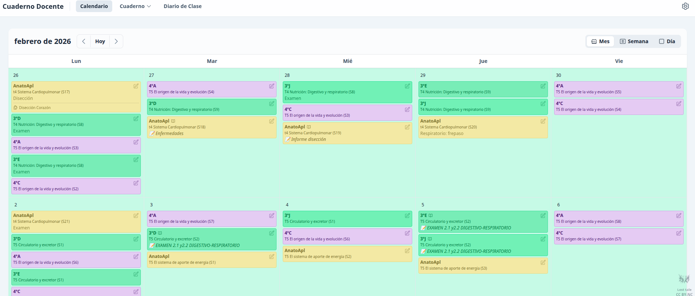 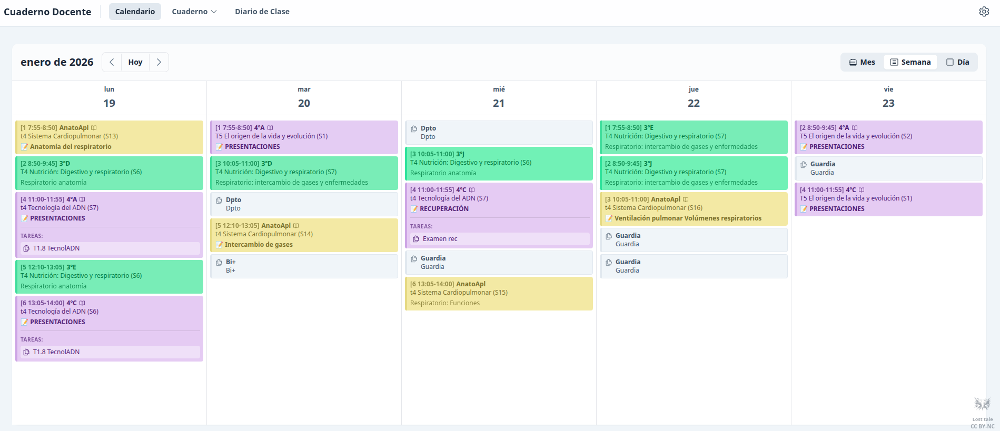 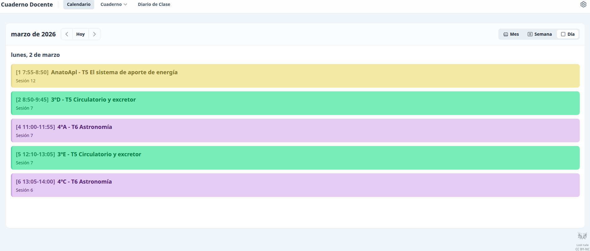

### Cuaderno
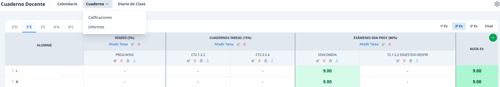 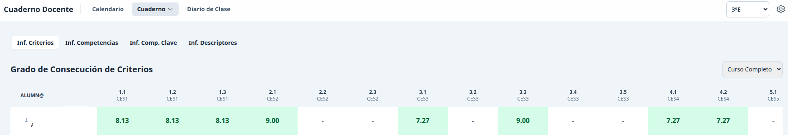 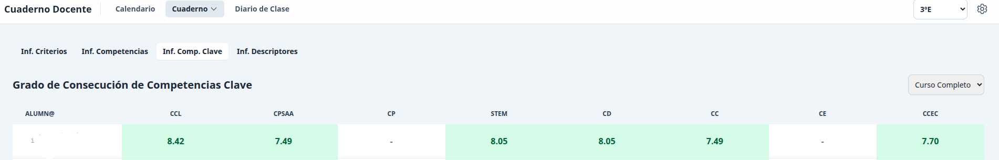

### Diario de clase
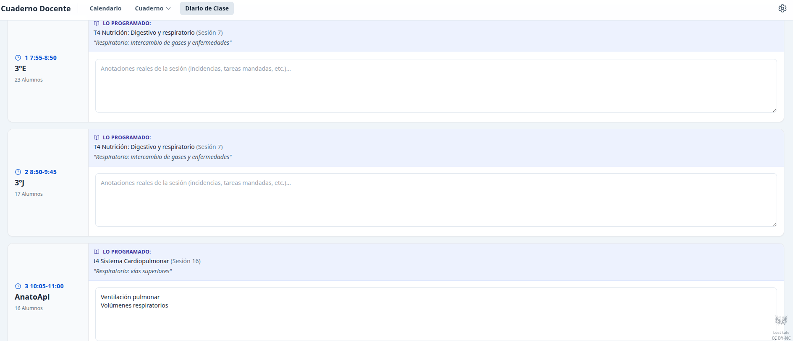

### Ajustes
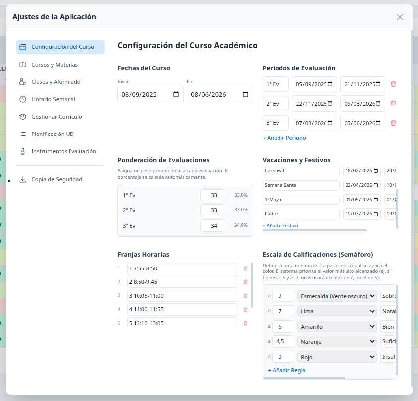 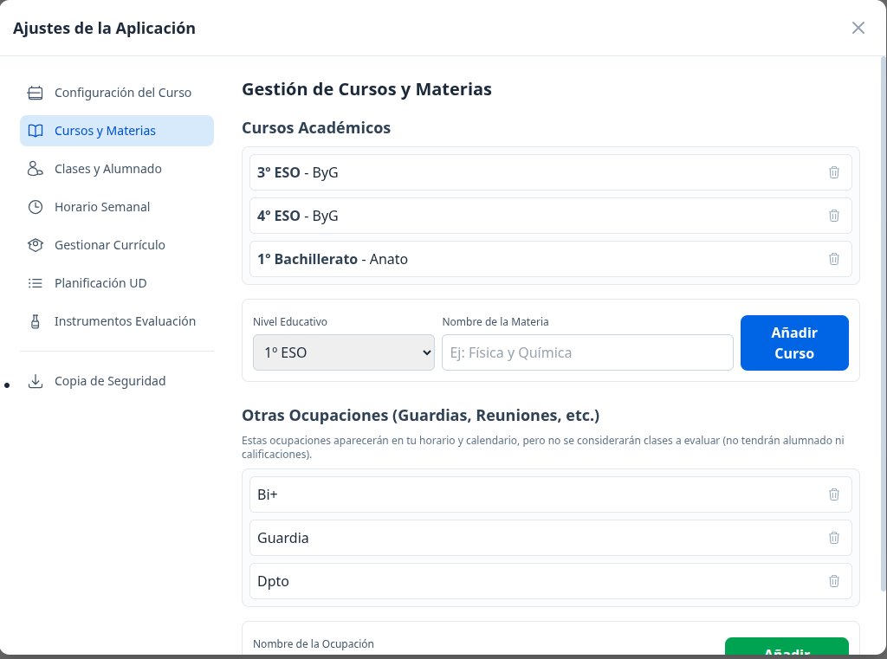 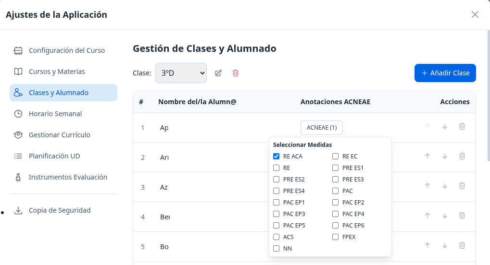 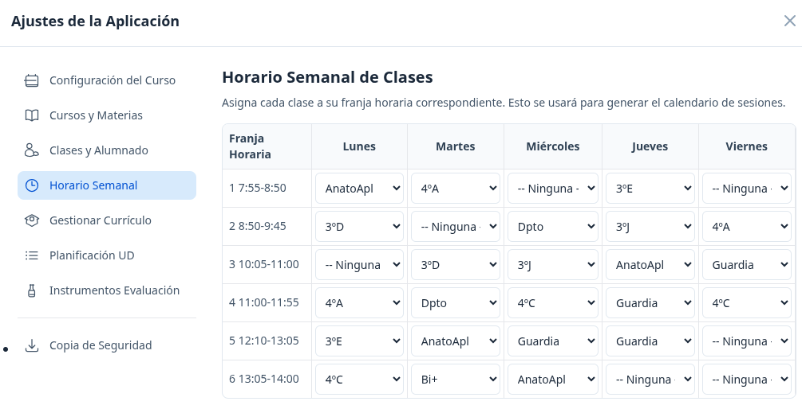  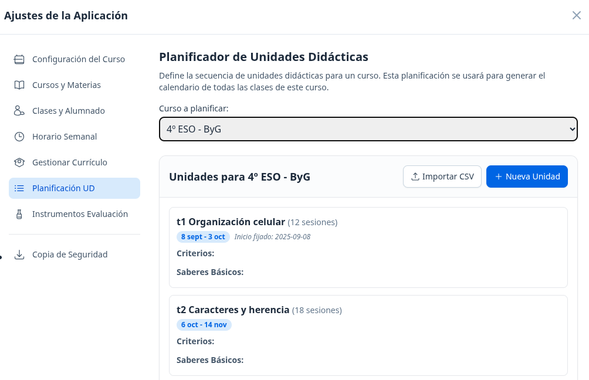 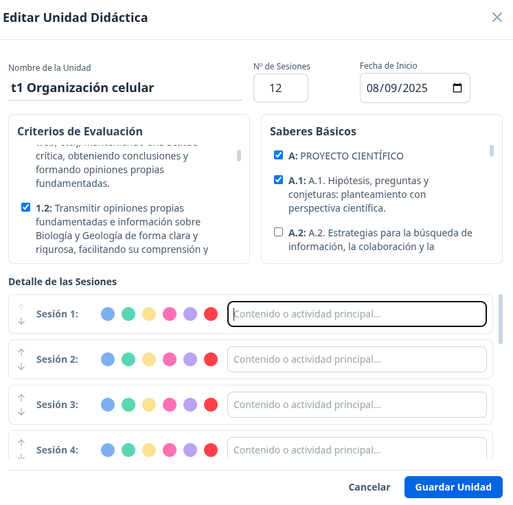 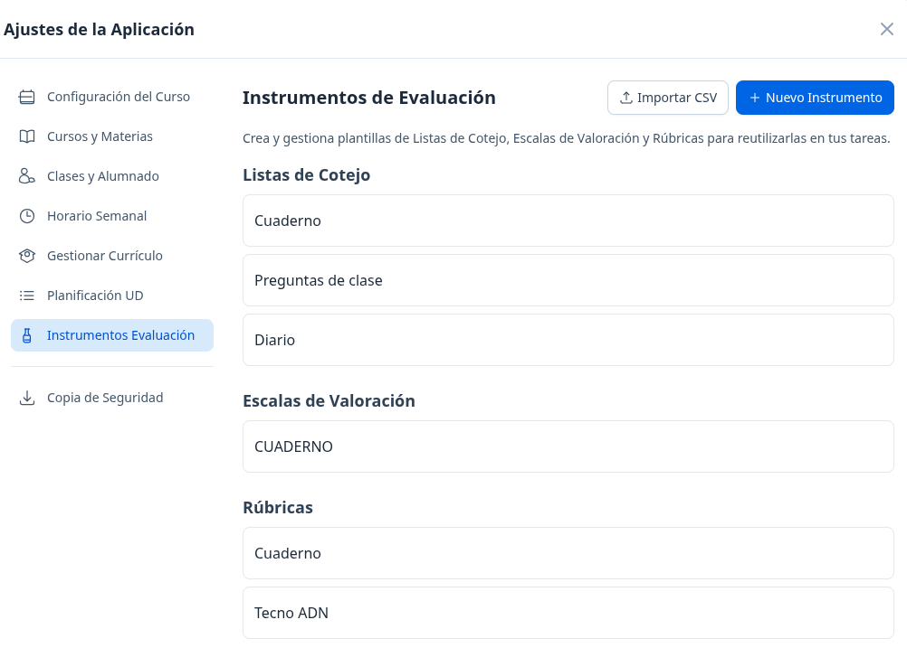 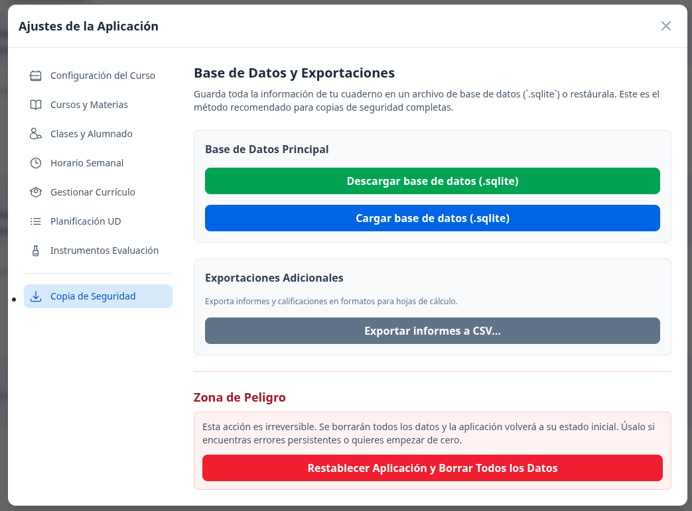

**→ [Ver todas las capturas (20+ imágenes)](screenshots/)**

## Manual de Usuario

Para aprender a usar todas las funciones de la aplicación:
[Ver Manual de Usuario](MANUAL_USUARIO.md)

## Currículo y adaptación por centro/región

Ninguna materia arranca con currículo cargado: se importa desde Ajustes → Gestionar
Currículo, como CSV propio o eligiendo una de las plantillas oficiales ya empaquetadas
en [`public/curriculos-oficiales/`](public/curriculos-oficiales/) (actualmente las del
Principado de Asturias — ver `curriculumPresets.ts`). El currículo LOMLOE varía por
comunidad autónoma y por decisiones de cada centro, así que forkar este proyecto para
sustituir esas plantillas por las de otra región, o adaptar cualquier otro detalle, es
un caso de uso esperado, no una desviación del proyecto original.

## Licencia

Ver [LICENSE](LICENSE). Basado en CuadernMestre v1.0 (CC BY-NC 4.0) — atribución
obligatoria, uso no comercial, se permite adaptar y redistribuir.
